# A4001 Avionics System – System Specification (Rev A)

> **Document purpose** – This specification defines the requirements for the A4001 Avionics System including functional, performance, environmental, interface, safety, reliability, maintainability, certification, and test requirements.

---

## 1 Document Control

### 1.1 Revision History

| Revision   | Date       | Description      | Author                          |
|------------|------------|------------------|---------------------------------|
| A          | 2025‑04‑20 | Initial release  | GAIA AIR Certification Team     |

### 1.2 Approval

| Role                    | Name   | Organization   | Signature   | Date       |
|-------------------------|--------|----------------|-------------|------------|
| System Engineer         | [Name] | GAIA AIR       | _______     | YYYY-MM-DD |
| Chief Engineer          | [Name] | GAIA AIR       | _______     | YYYY-MM-DD |
| Certification Manager   | [Name] | GAIA AIR       | _______     | YYYY-MM-DD |
| Quality Assurance       | [Name] | GAIA AIR       | _______     | YYYY-MM-DD |

### 1.3 Distribution

This document is distributed to:

1.  GAIA AIR Engineering Team
2.  GAIA AIR Certification Team
3.  Supplier Engineering Teams
4.  EASA Certification Authority (as required)

---

## 2 Introduction

### 2.1 Purpose

This System Specification defines the requirements for the A4001 Avionics System. It establishes the functional, performance, environmental, interface, safety, reliability, maintainability, certification, and test requirements that the system must satisfy.

### 2.2 Scope

This specification applies to the A4001 Avionics System and all its subsystems:
- A4001-A: Flight Control System
- A4001-B: Navigation System
- A4001-C: Communication System

### 2.3 Document Structure

This document is organized as follows:
- Section 1: Document Control
- Section 2: Introduction
- Section 3: Applicable Documents
- Section 4: System Overview
- Section 5: Functional Requirements
- Section 6: Performance Requirements
- Section 7: Environmental Requirements
- Section 8: Interface Requirements
- Section 9: Safety Requirements
- Section 10: Reliability Requirements
- Section 11: Maintainability Requirements
- Section 12: Certification Requirements
- Section 13: Test Requirements
- Section 14: Acronyms & Abbreviations
- Section 15: References
- Section 16: Appendices

### 2.4 Requirement Identification

Requirements in this document are uniquely identified using the following convention:

[System]-[Category]-[Sequential Number]

Where:
- \[System] = A4001
- \[Category] = FUNC (Functional), PERF (Performance), ENV (Environmental), INT (Interface), SAF (Safety), REL (Reliability), MAINT (Maintainability), CERT (Certification), TEST (Test)
- \[Sequential Number] = Three-digit sequential number (e.g., 001, 002, etc.)

Example: A4001-FUNC-001

---

## 3 Applicable Documents

### 3.1 Regulations

1.  EASA CS-25 Certification Specifications for Large Aeroplanes
2.  EASA AMC 25.1309 System Design and Analysis
3.  RTCA DO-178C Software Considerations in Airborne Systems and Equipment Certification
4.  RTCA DO-254 Design Assurance Guidance for Airborne Electronic Hardware
5.  RTCA DO-160G Environmental Conditions and Test Procedures for Airborne Equipment

### 3.2 Standards

1.  ARINC 429 Digital Information Transfer System (DITS)
2.  ARINC 664 Aircraft Data Network
3.  ARINC 653 Avionics Application Software Standard Interface
4.  MIL-STD-1553B Digital Time Division Command/Response Multiplex Data Bus
5.  MIL-STD-810G Environmental Engineering Considerations and Laboratory Tests

### 3.3 Project Documents

1.  System Overview — GP-AM-AMPEL-0100-42-001-OV-A
2.  System Design Description — GP-AM-AMPEL-0100-42-003-SDD-A
3.  Interface Control Document — GP-AM-AMPEL-0100-42-004-ICD-A
4.  Interface Matrix — GP-AM-AMPEL-0100-42-007-CAT-A
5.  Safety Assessment Report — GP-AM-AMPEL-0100-42-010-SAR-A

---

## 4 System Overview

### 4.1 System Description

The A4001 Avionics System is an integrated suite of electronic systems that provides flight control, navigation, and communication functions for the aircraft. The system consists of three main subsystems:

1.  A4001-A: Flight Control System
    -   Primary and Secondary Flight Computers
    -   Flight Control Laws Processing Unit
    -   Actuator Control Unit
    -   Flight Mode Selector

2.  A4001-B: Navigation System
    -   A4001-B-1: GPS Receiver
    -   A4001-B-2: Inertial Navigation System

3.  A4001-C: Communication System
    -   VHF and HF Transceivers
    -   SATCOM Interface
    -   Data Link Processor
    -   Audio Management Unit

### 4.2 System Architecture

The A4001 Avionics System employs a distributed architecture with redundant components and communication paths to ensure high reliability and availability. The system uses a combination of ARINC 429, ARINC 664 (AFDX), and MIL-STD-1553B data buses for internal and external communications.

[System Architecture Diagram to be inserted here]

### 4.3 System Boundaries

The A4001 Avionics System interfaces with the following aircraft systems:
-   Flight Control Actuators
-   Primary Flight Display
-   Engine Control System
-   Aircraft Power System
-   Cockpit Control Panels
-   Warning Systems
-   Landing Gear System
-   Fuel Management System
-   Navigation Sensors
-   Weather Radar
-   Environmental Control System
-   Communication Radios

Ground Support Equipment interfaces include:
-   Maintenance Computer
-   Test Equipment

### 4.4 Operational Concept

The A4001 Avionics System operates continuously during all phases of flight, from pre-flight through post-flight. It provides the following primary functions:
-   Flight control and stability augmentation
-   Navigation and positioning
-   Communication with ground stations and other aircraft
-   System monitoring and fault detection

---

## 5 Functional Requirements

### 5.1 General Requirements

| ID             | Requirement                                                                     | Verification Method   |
|----------------|---------------------------------------------------------------------------------|-----------------------|
| A4001-FUNC-001 | The A4001 Avionics System shall provide flight control, navigation, and communication functions.| Demonstration         |
| A4001-FUNC-002 | The A4001 Avionics System shall operate in all phases of flight.                | Test                  |
| A4001-FUNC-003 | The A4001 Avionics System shall provide built-in test capability.               | Test                  |
| A4001-FUNC-004 | The A4001 Avionics System shall provide fault detection, isolation, and recovery capabilities.| Test                  |
| A4001-FUNC-005 | The A4001 Avionics System shall provide status information to the flight crew.  | Demonstration         |

### 5.2 Flight Control System Requirements

| ID             | Requirement                                                                     | Verification Method   |
|----------------|---------------------------------------------------------------------------------|-----------------------|
| A4001-FUNC-101 | The Flight Control System shall process pilot inputs and sensor data to generate control surface commands.| Test                  |
| A4001-FUNC-102 | The Flight Control System shall provide stability augmentation in all axes (pitch, roll, yaw).| Test                  |
| A4001-FUNC-103 | The Flight Control System shall provide flight envelope protection.             | Test                  |
| A4001-FUNC-104 | The Flight Control System shall provide autopilot functionality.                | Test                  |
| A4001-FUNC-105 | The Flight Control System shall provide flight director guidance.               | Test                  |

### 5.3 Navigation System Requirements

| ID             | Requirement                                                                     | Verification Method   |
|----------------|---------------------------------------------------------------------------------|-----------------------|
| A4001-FUNC-201 | The Navigation System shall determine aircraft position with an accuracy of \[TBD].| Test                  |
| A4001-FUNC-202 | The Navigation System shall provide attitude, heading, and air data information.  | Test                  |
| A4001-FUNC-203 | The Navigation System shall support RNAV and RNP operations.                    | Test                  |
| A4001-FUNC-204 | The Navigation System shall provide approach guidance for precision and non-precision approaches.| Test                  |
| A4001-FUNC-205 | The Navigation System shall provide terrain awareness.                          | Test                  |

### 5.4 Communication System Requirements

| ID             | Requirement                                                                     | Verification Method   |
|----------------|---------------------------------------------------------------------------------|-----------------------|
| A4001-FUNC-301 | The Communication System shall provide VHF voice communication.                 | Test                  |
| A4001-FUNC-302 | The Communication System shall provide HF voice communication.                  | Test                  |
| A4001-FUNC-303 | The Communication System shall provide SATCOM voice and data communication.     | Test                  |
| A4001-FUNC-304 | The Communication System shall provide datalink capability for CPDLC and ADS-C.| Test                  |
| A4001-FUNC-305 | The Communication System shall provide audio management for all communication sources.| Test                  |

---

## 6 Performance Requirements

### 6.1 General Performance Requirements

| ID             | Requirement                                                                     | Verification Method   |
|----------------|---------------------------------------------------------------------------------|-----------------------|
| A4001-PERF-001 | The A4001 Avionics System shall have a power-up time of less than 60 seconds.   | Test                  |
| A4001-PERF-002 | The A4001 Avionics System shall have a continuous operation capability of at least 24 hours.| Test                  |
| A4001-PERF-003 | The A4001 Avionics System shall have a data processing latency of less than 50 milliseconds for critical functions.| Test                  |
| A4001-PERF-004 | The A4001 Avionics System shall have a data refresh rate of at least 20 Hz for flight critical parameters.| Test                  |
| A4001-PERF-005 | The A4001 Avionics System shall have a mean time between failures (MTBF) of at least 10,000 flight hours.| Analysis              |

### 6.2 Flight Control System Performance

| ID             | Requirement                                                                     | Verification Method   |
|----------------|---------------------------------------------------------------------------------|-----------------------|
| A4001-PERF-101 | The Flight Control System shall have a control loop execution rate of at least 50 Hz.| Test                  |
| A4001-PERF-102 | The Flight Control System shall have a control surface command latency of less than 20 milliseconds.| Test                  |
| A4001-PERF-103 | The Flight Control System shall maintain aircraft stability in all certified flight conditions.| Test                  |
| A4001-PERF-104 | The Flight Control System shall provide autopilot tracking accuracy of ±50 feet for altitude and ±0.5 degrees for heading.| Test                  |
| A4001-PERF-105 | The Flight Control System shall detect and respond to failures within 100 milliseconds.| Test                  |

### 6.3 Navigation System Performance

| ID             | Requirement                                                                     | Verification Method   |
|----------------|---------------------------------------------------------------------------------|-----------------------|
| A4001-PERF-201 | The Navigation System shall provide position accuracy of ±0.1 NM during en-route operations.| Test                  |
| A4001-PERF-202 | The Navigation System shall provide position accuracy of ±0.3 NM during terminal operations.| Test                  |
| A4001-PERF-203 | The Navigation System shall provide position accuracy of ±0.1 NM during approach operations.| Test                  |
| A4001-PERF-204 | The Navigation System shall provide attitude accuracy of ±0.5 degrees.          | Test                  |
| A4001-PERF-205 | The Navigation System shall provide heading accuracy of ±1.0 degree.            | Test                  |

### 6.4 Communication System Performance

| ID             | Requirement                                                                     | Verification Method   |
|----------------|---------------------------------------------------------------------------------|-----------------------|
| A4001-PERF-301 | The Communication System shall provide VHF communication range of at least 200 NM at cruise altitude.| Test                  |
| A4001-PERF-302 | The Communication System shall provide HF communication range of at least 2,000 NM.| Test                  |
| A4001-PERF-303 | The Communication System shall provide SATCOM coverage in all operational areas.| Demonstration         |
| A4001-PERF-304 | The Communication System shall provide datalink message delivery with a success rate of at least 99%.| Test                  |
| A4001-PERF-305 | The Communication System shall provide audio quality with a minimum intelligibility score of 0.7 on the Speech Transmission Index.| Test                  |

---

## 7 Environmental Requirements

### 7.1 Temperature and Altitude

| ID            | Requirement                                                                     | Verification Method   |
|---------------|---------------------------------------------------------------------------------|-----------------------|
| A4001-ENV-001 | The A4001 Avionics System shall operate within specification at temperatures from -55°C to +70°C.| Test                  |
| A4001-ENV-002 | The A4001 Avionics System shall operate within specification at altitudes from sea level to 45,000 feet.| Test                  |
| A4001-ENV-003 | The A4001 Avionics System shall withstand rapid decompression from sea level to 45,000 feet in 1 second.| Test                  |
| A4001-ENV-004 | The A4001 Avionics System shall operate within specification during temperature changes of up to 10°C per minute.| Test                  |
| A4001-ENV-005 | The A4001 Avionics System shall operate within specification at relative humidity levels from 0% to 95% non-condensing.| Test                  |

### 7.2 Vibration and Shock

| ID            | Requirement                                                                     | Verification Method   |
|---------------|---------------------------------------------------------------------------------|-----------------------|
| A4001-ENV-101 | The A4001 Avionics System shall operate within specification when subjected to random vibration as defined in RTCA DO-160G Section 8 Category R.| Test                  |
| A4001-ENV-102 | The A4001 Avionics System shall operate within specification when subjected to sinusoidal vibration as defined in RTCA DO-160G Section 8 Category S.| Test                  |
| A4001-ENV-103 | The A4001 Avionics System shall operate within specification after being subjected to operational shocks of 6g peak, 11ms duration.| Test                  |
| A4001-ENV-104 | The A4001 Avionics System shall operate within specification after being subjected to crash safety shocks of 20g peak, 11ms duration.| Test                  |
| A4001-ENV-105 | The A4001 Avionics System shall operate within specification when subjected to continuous acceleration of 7g in any direction.| Test                  |

### 7.3 Electromagnetic Compatibility

| ID            | Requirement                                                                     | Verification Method   |
|---------------|---------------------------------------------------------------------------------|-----------------------|
| A4001-ENV-201 | The A4001 Avionics System shall operate within specification when subjected to conducted emissions as defined in RTCA DO-160G Section 21 Category M.| Test                  |
| A4001-ENV-202 | The A4001 Avionics System shall operate within specification when subjected to radiated emissions as defined in RTCA DO-160G Section 21 Category M.| Test                  |
| A4001-ENV-203 | The A4001 Avionics System shall operate within specification when subjected to conducted susceptibility as defined in RTCA DO-160G Section 20 Category R.| Test                  |
| A4001-ENV-204 | The A4001 Avionics System shall operate within specification when subjected to radiated susceptibility as defined in RTCA DO-160G Section 20 Category R.| Test                  |
| A4001-ENV-205 | The A4001 Avionics System shall operate within specification when subjected to lightning induced transients as defined in RTCA DO-160G Section 22 Category A3J3L3.| Test                  |

### 7.4 Power Supply

| ID            | Requirement                                                                     | Verification Method   |
|---------------|---------------------------------------------------------------------------------|-----------------------|
| A4001-ENV-301 | The A4001 Avionics System shall operate within specification when supplied with 28V DC power as defined in RTCA DO-160G Section 16 Category B.| Test                  |
| A4001-ENV-302 | The A4001 Avionics System shall operate within specification when supplied with 115V AC 400Hz power as defined in RTCA DO-160G Section 16 Category B.| Test                  |
| A4001-ENV-303 | The A4001 Avionics System shall operate within specification during power interruptions of up to 200ms.| Test                  |
| A4001-ENV-304 | The A4001 Avionics System shall operate within specification during voltage spikes as defined in RTCA DO-160G Section 17 Category A.| Test                  |
| A4001-ENV-305 | The A4001 Avionics System shall operate within specification during frequency variations as defined in RTCA DO-160G Section 16 Category B.| Test                  |

---

## 8 Interface Requirements

### 8.1 External Interfaces

| ID            | Requirement                                                                     | Verification Method   |
|---------------|---------------------------------------------------------------------------------|-----------------------|
| A4001-INT-001 | The A4001 Avionics System shall interface with Flight Control Actuators using ARINC 429 as defined in GP-AM-AMPEL-0100-42-007-CAT-A.| Test                  |
| A4001-INT-002 | The A4001 Avionics System shall interface with the Aircraft Power System using 28V DC and 115V AC 400Hz as defined in GP-AM-AMPEL-0100-42-007-CAT-A.| Test                  |
| A4001-INT-003 | The A4001 Avionics System shall interface with the Primary Flight Display using ARINC 664 (AFDX) as defined in GP-AM-AMPEL-0100-42-007-CAT-A.| Test                  |
| A4001-INT-004 | The A4001 Avionics System shall interface with the Engine Control System using ARINC 429 as defined in GP-AM-AMPEL-0100-42-007-CAT-A.| Test                  |
| A4001-INT-005 | The A4001 Avionics System shall interface with Maintenance Computer (GSE) using Ethernet as defined in GP-AM-AMPEL-0100-42-007-CAT-A.| Test                  |

### 8.2 Internal Interfaces

| ID            | Requirement                                                                     | Verification Method   |
|---------------|---------------------------------------------------------------------------------|-----------------------|
| A4001-INT-101 | The Flight Control System shall interface with the Navigation System using ARINC 429 as defined in GP-AM-AMPEL-0100-42-007-CAT-A.| Test                  |
| A4001-INT-102 | The Navigation System shall interface with the Flight Control System using ARINC 429 as defined in GP-AM-AMPEL-0100-42-007-CAT-A.| Test                  |
| A4001-INT-103 | The Navigation System shall interface with the Communication System using ARINC 429 as defined in GP-AM-AMPEL-0100-42-007-CAT-A.| Test                  |
| A4001-INT-104 | The Communication System shall interface with the Flight Control System using ARINC 429 as defined in GP-AM-AMPEL-0100-42-007-CAT-A.| Test                  |
| A4001-INT-105 | All subsystems shall interface with the System Data Bus using ARINC 664 (AFDX) as defined in GP-AM-AMPEL-0100-42-007-CAT-A.| Test                  |

### 8.3 Software Interfaces

| ID            | Requirement                                                                     | Verification Method   |
|---------------|---------------------------------------------------------------------------------|-----------------------|
| A4001-INT-201 | The Flight Control Software shall interface with the Navigation Software using ARINC 653 API as defined in GP-AM-AMPEL-0100-42-007-CAT-A.| Test                  |
| A4001-INT-202 | The Navigation Software shall interface with the Communication Software using ARINC 653 API as defined in GP-AM-AMPEL-0100-42-007-CAT-A.| Test                  |
| A4001-INT-203 | All software modules shall interface with the Operating System using ARINC 653 API.| Test                  |
| A4001-INT-204 | All software modules shall interface with the Health Monitoring software using defined APIs.| Test                  |
| A4001-INT-205 | All software modules shall interface with the Maintenance software using defined APIs.| Test                  |

---

## 9 Safety Requirements

### 9.1 General Safety Requirements

| ID            | Requirement                                                                     | Verification Method   |
|---------------|---------------------------------------------------------------------------------|-----------------------|
| A4001-SAF-001 | The A4001 Avionics System shall be developed to Design Assurance Level (DAL) A as defined in RTCA DO-178C and DO-254.| Analysis              |
| A4001-SAF-002 | The A4001 Avionics System shall not have any single point of failure that could result in a catastrophic failure condition.| Analysis              |
| A4001-SAF-003 | The A4001 Avionics System shall detect and annunciate all failures that could result in hazardous or catastrophic failure conditions.| Test                  |
| A4001-SAF-004 | The A4001 Avionics System shall provide failure detection coverage of at least 99% for all critical functions.| Analysis              |
| A4001-SAF-005 | The A4001 Avionics System shall maintain safe operation after any single failure.| Test                  |

### 9.2 Specific Safety Requirements

| ID            | Requirement                                                                     | Verification Method   |
|---------------|---------------------------------------------------------------------------------|-----------------------|
| A4001-SAF-101 | The Flight Control System shall maintain aircraft control after any single failure.| Test                  |
| A4001-SAF-102 | The Navigation System shall provide position integrity monitoring and alerting. | Test                  |
| A4001-SAF-103 | The Communication System shall provide alternate communication paths in case of primary path failure.| Test                  |
| A4001-SAF-104 | The A4001 Avionics System shall prevent inadvertent mode changes during critical flight phases.| Test                  |
| A4001-SAF-105 | The A4001 Avionics System shall provide protection against erroneous pilot inputs that could result in unsafe conditions.| Test                  |

### 9.3 Failure Conditions

| ID            | Requirement                                                                     | Verification Method   |
|---------------|---------------------------------------------------------------------------------|-----------------------|
| A4001-SAF-201 | Loss of all flight control functions shall have a probability of occurrence less than 1x10^-9 per flight hour.| Analysis              |
| A4001-SAF-202 | Loss of all navigation functions shall have a probability of occurrence less than 1x10^-7 per flight hour.| Analysis              |
| A4001-SAF-203 | Loss of all communication functions shall have a probability of occurrence less than 1x10^-5 per flight hour.| Analysis              |
| A4001-SAF-204 | Undetected erroneous flight control commands shall have a probability of occurrence less than 1x10^-9 per flight hour.| Analysis              |
| A4001-SAF-205 | Undetected erroneous navigation data shall have a probability of occurrence less than 1x10^-7 per flight hour.| Analysis              |

---

## 10 Reliability Requirements

### 10.1 General Reliability Requirements

| ID            | Requirement                                                                     | Verification Method   |
|---------------|---------------------------------------------------------------------------------|-----------------------|
| A4001-REL-001 | The A4001 Avionics System shall have a Mean Time Between Failures (MTBF) of at least 10,000 flight hours.| Analysis              |
| A4001-REL-002 | The A4001 Avionics System shall have a probability of dispatch with all functions operational of at least 99%.| Analysis              |
| A4001-REL-003 | The A4001 Avionics System shall have a probability of mission completion without failure of at least 99.9%.| Analysis              |
| A4001-REL-004 | The A4001 Avionics System shall have a service life of at least 20,000 flight hours or 10 years, whichever occurs first.| Analysis              |
| A4001-REL-005 | The A4001 Avionics System shall have a reliability growth rate of at least 10% per year during the first 5 years of operation.| Analysis              |

### 10.2 Subsystem Reliability Requirements

| ID            | Requirement                                                                     | Verification Method   |
|---------------|---------------------------------------------------------------------------------|-----------------------|
| A4001-REL-101 | The Flight Control System shall have an MTBF of at least 20,000 flight hours.   | Analysis              |
| A4001-REL-102 | The Navigation System shall have an MTBF of at least 15,000 flight hours.       | Analysis              |
| A4001-REL-103 | The Communication System shall have an MTBF of at least 12,000 flight hours.    | Analysis              |
| A4001-REL-104 | The System Data Bus shall have an MTBF of at least 50,000 flight hours.         | Analysis              |
| A4001-REL-105 | The Power Supply shall have an MTBF of at least 30,000 flight hours.            | Analysis              |

### 10.3 Redundancy Requirements

| ID            | Requirement                                                                     | Verification Method   |
|---------------|---------------------------------------------------------------------------------|-----------------------|
| A4001-REL-201 | The Flight Control System shall employ triple redundancy for all critical functions.| Inspection            |
| A4001-REL-202 | The Navigation System shall employ dual redundancy for all critical functions.  | Inspection            |
| A4001-REL-203 | The Communication System shall employ dual redundancy for all critical functions.| Inspection            |
| A4001-REL-204 | The System Data Bus shall employ dual redundancy.                               | Inspection            |
| A4001-REL-205 | The Power Supply shall employ dual redundancy.                                  | Inspection            |

---

## 11 Maintainability Requirements

### 11.1 General Maintainability Requirements

| ID             | Requirement                                                                     | Verification Method   |
|----------------|---------------------------------------------------------------------------------|-----------------------|
| A4001-MAINT-001| The A4001 Avionics System shall have a Mean Time To Repair (MTTR) of less than 2 hours.| Analysis              |
| A4001-MAINT-002| The A4001 Avionics System shall have Built-In Test (BIT) capability that detects at least 95% of all failures.| Test                  |
| A4001-MAINT-003| The A4001 Avionics System shall have Line Replaceable Units (LRUs) that can be removed and replaced without special tools.| Demonstration         |
| A4001-MAINT-004| The A4001 Avionics System shall have a maintenance interval of at least 5,000 flight hours.| Analysis              |
| A4001-MAINT-005| The A4001 Avionics System shall provide maintenance data recording for at least the last 100 flight hours.| Test                  |

### 11.2 Diagnostic Requirements

| ID             | Requirement                                                                     | Verification Method   |
|----------------|---------------------------------------------------------------------------------|-----------------------|
| A4001-MAINT-101| The A4001 Avionics System shall perform a comprehensive self-test at power-up.    | Test                  |
| A4001-MAINT-102| The A4001 Avionics System shall perform continuous background monitoring during operation.| Test                  |
| A4001-MAINT-103| The A4001 Avionics System shall provide fault isolation to the LRU level.       | Test                  |
| A4001-MAINT-104| The A4001 Avionics System shall provide maintenance alerts for impending failures.| Test                  |
| A4001-MAINT-105| The A4001 Avionics System shall provide a maintenance interface for external diagnostic equipment.| Test                  |

### 11.3 Maintenance Data Requirements

| ID             | Requirement                                                                     | Verification Method   |
|----------------|---------------------------------------------------------------------------------|-----------------------|
| A4001-MAINT-201| The A4001 Avionics System shall record all detected failures with date, time, and flight phase.| Test                  |
| A4001-MAINT-202| The A4001 Avionics System shall record all maintenance actions with date, time, and technician ID.| Test                  |
| A4001-MAINT-203| The A4001 Avionics System shall record system performance parameters for trend analysis.| Test                  |
| A4001-MAINT-204| The A4001 Avionics System shall provide maintenance data in a standard format compatible with airline maintenance systems.| Test                  |
| A4001-MAINT-205| The A4001 Avionics System shall retain maintenance data after power loss.       | Test                  |

---

## 12 Certification Requirements

### 12.1 General Certification Requirements

| ID            | Requirement                                                                     | Verification Method   |
|---------------|---------------------------------------------------------------------------------|-----------------------|
| A4001-CERT-001| The A4001 Avionics System shall comply with EASA CS-25 certification requirements.| Analysis              |
| A4001-CERT-002| The A4001 Avionics System software shall be developed in accordance with RTCA DO-178C Level A.| Analysis              |
| A4001-CERT-003| The A4001 Avionics System hardware shall be developed in accordance with RTCA DO-254 Level A.| Analysis              |
| A4001-CERT-004| The A4001 Avionics System shall be environmentally qualified in accordance with RTCA DO-160G.| Test                  |
| A4001-CERT-005| The A4001 Avionics System shall have a Safety Assessment in accordance with EASA AMC 25.1309.| Analysis              |

### 12.2 Documentation Requirements

| ID            | Requirement                                                                     | Verification Method   |
|---------------|---------------------------------------------------------------------------------|-----------------------|
| A4001-CERT-101| The A4001 Avionics System shall have a Plan for Software Aspects of Certification (PSAC).| Inspection            |
| A4001-CERT-102| The A4001 Avionics System shall have a Plan for Hardware Aspects of Certification (PHAC).| Inspection            |
| A4001-CERT-103| The A4001 Avionics System shall have a Functional Hazard Assessment (FHA).      | Inspection            |
| A4001-CERT-104| The A4001 Avionics System shall have a System Safety Assessment (SSA).          | Inspection            |
| A4001-CERT-105| The A4001 Avionics System shall have a Declaration of Design and Performance (DDP).| Inspection            |

### 12.3 Compliance Requirements

| ID            | Requirement                                                                     | Verification Method   |
|---------------|---------------------------------------------------------------------------------|-----------------------|
| A4001-CERT-201| The A4001 Avionics System shall demonstrate compliance with all applicable EASA Special Conditions.| Analysis              |
| A4001-CERT-202| The A4001 Avionics System shall demonstrate compliance with all applicable EASA Certification Review Items (CRIs).| Analysis              |
| A4001-CERT-203| The A4001 Avionics System shall demonstrate compliance with all applicable EASA Interpretative Material.| Analysis              |
| A4001-CERT-204| The A4001 Avionics System shall have a Compliance Checklist that traces all certification requirements to verification evidence.| Inspection            |
| A4001-CERT-205| The A4001 Avionics System shall have a Certification Summary Report.            | Inspection            |

---

## 13 Test Requirements

### 13.1 General Test Requirements

| ID            | Requirement                                                                     | Verification Method   |
|---------------|---------------------------------------------------------------------------------|-----------------------|
| A4001-TEST-001| The A4001 Avionics System shall undergo unit testing for all software components.| Inspection            |
| A4001-TEST-002| The A4001 Avionics System shall undergo integration testing for all subsystems. | Test                  |
| A4001-TEST-003| The A4001 Avionics System shall undergo system testing for the complete system. | Test                  |
| A4001-TEST-004| The A4001 Avionics System shall undergo environmental qualification testing per RTCA DO-160G.| Test                  |
| A4001-TEST-005| The A4001 Avionics System shall undergo EMI/EMC testing per RTCA DO-160G.       | Test                  |

### 13.2 Verification Methods

| ID            | Requirement                                                                     | Verification Method   |
|---------------|---------------------------------------------------------------------------------|-----------------------|
| A4001-TEST-101| All requirements shall be verified by one or more of the following methods: Analysis, Inspection, Demonstration, or Test.| Inspection            |
| A4001-TEST-102| All safety-critical requirements shall be verified by Test.                     | Inspection            |
| A4001-TEST-103| All performance requirements shall be verified by Test or Analysis.             | Inspection            |
| A4001-TEST-104| All interface requirements shall be verified by Test.                           | Inspection            |
| A4001-TEST-105| All environmental requirements shall be verified by Test.                       | Inspection            |

### 13.3 Test Documentation

| ID            | Requirement                                                                     | Verification Method   |
|---------------|---------------------------------------------------------------------------------|-----------------------|
| A4001-TEST-201| The A4001 Avionics System shall have a Master Test Plan.                        | Inspection            |
| A4001-TEST-202| The A4001 Avionics System shall have Test Procedures for all tests.             | Inspection            |
| A4001-TEST-203| The A4001 Avionics System shall have Test Reports for all tests.              | Inspection            |
| A4001-TEST-204| The A4001 Avionics System shall have a Requirements Verification Matrix.        | Inspection            |
| A4001-TEST-205| The A4001 Avionics System shall have a Verification and Validation Summary Report.| Inspection            |

---

## 14 Acronyms & Abbreviations

| Acronym   | Definition                                  |
|-----------|---------------------------------------------|
| AFDX      | Avionics Full-Duplex Switched Ethernet      |
| AMC       | Acceptable Means of Compliance              |
| API       | Application Programming Interface           |
| ARINC     | Aeronautical Radio Incorporated             |
| BIT       | Built-In Test                               |
| CRI       | Certification Review Item                   |
| CS        | Certification Specification                 |
| DAL       | Design Assurance Level                      |
| DDP       | Declaration of Design and Performance       |
| EASA      | European Union Aviation Safety Agency       |
| EMC       | Electromagnetic Compatibility               |
| EMI       | Electromagnetic Interference                |
| FHA       | Functional Hazard Assessment                |
| GSE       | Ground Support Equipment                    |
| HF        | High Frequency                              |
| ICD       | Interface Control Document                  |
| LRU       | Line Replaceable Unit                       |
| MTBF      | Mean Time Between Failures                  |
| MTTR      | Mean Time To Repair                       |
| PHAC      | Plan for Hardware Aspects of Certification|
| PSAC      | Plan for Software Aspects of Certification|
| RNAV      | Area Navigation                             |
| RNP       | Required Navigation Performance             |
| RTCA      | Radio Technical Commission for Aeronautics|
| SATCOM    | Satellite Communication                     |
| SSA       | System Safety Assessment                    |
| VHF       | Very High Frequency                         |

---

## 15 References

1.  EASA CS-25 Certification Specifications for Large Aeroplanes
2.  EASA AMC 25.1309 System Design and Analysis
3.  RTCA DO-178C Software Considerations in Airborne Systems and Equipment Certification
4.  RTCA DO-254 Design Assurance Guidance for Airborne Electronic Hardware
5.  RTCA DO-160G Environmental Conditions and Test Procedures for Airborne Equipment
6.  ARINC 429 Digital Information Transfer System (DITS)
7.  ARINC 664 Aircraft Data Network
8.  ARINC 653 Avionics Application Software Standard Interface
9.  MIL-STD-1553B Digital Time Division Command/Response Multiplex Data Bus
10. System Overview — GP-AM-AMPEL-0100-42-001-OV-A
11. System Design Description — GP-AM-AMPEL-0100-42-003-SDD-A
12. Interface Control Document — GP-AM-AMPEL-0100-42-004-ICD-A
13. Interface Matrix — GP-AM-AMPEL-0100-42-007-CAT-A
14. Safety Assessment Report — GP-AM-AMPEL-0100-42-010-SAR-A

---

## 16 Appendices

### Appendix A: Requirements Traceability Matrix

### Appendix A: Requirements Traceability Matrix

## A.1 Purpose

This Requirements Traceability Matrix (RTM) establishes bidirectional traceability between the A4001 Avionics System requirements and their sources, as well as their verification methods and associated documentation. The RTM serves as a tool for ensuring that:

1.  All requirements are derived from valid sources
2.  All requirements are verified by appropriate methods
3.  All requirements are documented in relevant project artifacts
4.  Changes to requirements can be tracked and managed

## A.2 Matrix Structure

The RTM is organized by requirement categories as defined in the main specification document. For each requirement, the following information is provided:

-   **Requirement ID**: Unique identifier for the requirement
-   **Requirement Summary**: Brief description of the requirement
-   **Source**: Origin of the requirement (regulation, standard, customer requirement, etc.)
-   **Verification Method**: Method used to verify the requirement (Analysis, Inspection, Demonstration, Test)
-   **Verification Document**: Reference to the document containing verification evidence
-   **Status**: Current status of the requirement verification (Planned, In Progress, Verified, Waived)

## A.3 Requirements Traceability Matrix

### A.3.1 Functional Requirements

| Requirement ID   | Requirement Summary                                       | Source         | Verification Method   | Verification Document               | Status    |
|------------------|-----------------------------------------------------------|----------------|-----------------------|-------------------------------------|-----------|
| A4001-FUNC-001 | Provide flight control, navigation, and communication functions| CS-25.1301     | Demonstration         | GP-AM-AMPEL-0100-42-101-TST-A       | Planned   |
| A4001-FUNC-002 | Operate in all phases of flight                           | CS-25.1301     | Test                  | GP-AM-AMPEL-0100-42-102-TST-A       | Planned   |
| A4001-FUNC-003 | Provide built-in test capability                          | CS-25.1309     | Test                  | GP-AM-AMPEL-0100-42-103-TST-A       | Planned   |
| A4001-FUNC-004 | Provide fault detection, isolation, and recovery          | CS-25.1309     | Test                  | GP-AM-AMPEL-0100-42-104-TST-A       | Planned   |
| A4001-FUNC-005 | Provide status information to flight crew                 | CS-25.1322     | Demonstration         | GP-AM-AMPEL-0100-42-105-TST-A       | Planned   |
| A4001-FUNC-101 | Process pilot inputs and sensor data                      | CS-25.671      | Test                  | GP-AM-AMPEL-0100-42-106-TST-A       | Planned   |
| A4001-FUNC-102 | Provide stability augmentation in all axes (pitch, roll, yaw)| CS-25.672      | Test                  | GP-AM-AMPEL-0100-42-107-TST-A       | Planned   |
| A4001-FUNC-103 | Provide flight envelope protection                        | CS-25.672      | Test                  | GP-AM-AMPEL-0100-42-108-TST-A       | Planned   |
| A4001-FUNC-104 | Provide autopilot functionality                           | CS-25.1329     | Test                  | GP-AM-AMPEL-0100-42-109-TST-A       | Planned   |
| A4001-FUNC-105 | Provide flight director guidance                          | CS-25.1329     | Test                  | GP-AM-AMPEL-0100-42-110-TST-A       | Planned   |
| A4001-FUNC-201 | Determine aircraft position with specified accuracy       | CS-25.1301     | Test                  | GP-AM-AMPEL-0100-42-111-TST-A       | Planned   |
| A4001-FUNC-202 | Provide attitude, heading, and air data information       | CS-25.1303     | Test                  | GP-AM-AMPEL-0100-42-112-TST-A       | Planned   |
| A4001-FUNC-203 | Support RNAV and RNP operations                           | CS-25.1301     | Test                  | GP-AM-AMPEL-0100-42-113-TST-A       | Planned   |
| A4001-FUNC-204 | Provide approach guidance                                 | CS-25.1301     | Test                  | GP-AM-AMPEL-0100-42-114-TST-A       | Planned   |
| A4001-FUNC-205 | Provide terrain awareness                                 | CS-25.1309     | Test                  | GP-AM-AMPEL-0100-42-115-TST-A       | Planned   |
| A4001-FUNC-301 | Provide VHF voice communication                           | CS-25.1307     | Test                  | GP-AM-AMPEL-0100-42-116-TST-A       | Planned   |
| A4001-FUNC-302 | Provide HF voice communication                            | CS-25.1307     | Test                  | GP-AM-AMPEL-0100-42-117-TST-A       | Planned   |
| A4001-FUNC-303 | Provide SATCOM voice and data communication               | CS-25.1307     | Test                  | GP-AM-AMPEL-0100-42-118-TST-A       | Planned   |
| A4001-FUNC-304 | Provide datalink capability for CPDLC and ADS-C           | CS-25.1307     | Test                  | GP-AM-AMPEL-0100-42-119-TST-A       | Planned   |
| A4001-FUNC-305 | Provide audio management for all communication sources    | CS-25.1307     | Test                  | GP-AM-AMPEL-0100-42-120-TST-A       | Planned   |

### A.3.2 Performance Requirements

| Requirement ID   | Requirement Summary                                       | Source        | Verification Method   | Verification Document               | Status    |
|------------------|-----------------------------------------------------------|---------------|-----------------------|-------------------------------------|-----------|
| A4001-PERF-001 | Power-up time < 60 seconds                                | Customer Req. | Test                  | GP-AM-AMPEL-0100-42-201-TST-A       | Planned   |
| A4001-PERF-002 | Continuous operation capability ≥ 24 hours                | Customer Req. | Test                  | GP-AM-AMPEL-0100-42-202-TST-A       | Planned   |
| A4001-PERF-003 | Data processing latency < 50 ms                             | Customer Req. | Test                  | GP-AM-AMPEL-0100-42-203-TST-A       | Planned   |
| A4001-PERF-004 | Data refresh rate ≥ 20 Hz                                 | Customer Req. | Test                  | GP-AM-AMPEL-0100-42-204-TST-A       | Planned   |
| A4001-PERF-005 | MTBF ≥ 10,000 flight hours                                | Customer Req. | Analysis              | GP-AM-AMPEL-0100-42-205-ANL-A       | Planned   |
| A4001-PERF-101 | Control loop execution rate ≥ 50 Hz                       | CS-25.671     | Test                  | GP-AM-AMPEL-0100-42-206-TST-A       | Planned   |
| A4001-PERF-102 | Control surface command latency < 20 ms                     | CS-25.671     | Test                  | GP-AM-AMPEL-0100-42-207-TST-A       | Planned   |
| A4001-PERF-103 | Maintain aircraft stability                               | CS-25.672     | Test                  | GP-AM-AMPEL-0100-42-208-TST-A       | Planned   |
| A4001-PERF-104 | Autopilot tracking accuracy                               | CS-25.1329    | Test                  | GP-AM-AMPEL-0100-42-209-TST-A       | Planned   |
| A4001-PERF-105 | Failure detection and response time                       | CS-25.1309    | Test                  | GP-AM-AMPEL-0100-42-210-TST-A       | Planned   |
| A4001-PERF-201 | Position accuracy during en-route                         | CS-25.1301    | Test                  | GP-AM-AMPEL-0100-42-211-TST-A       | Planned   |
| A4001-PERF-202 | Position accuracy during terminal operations              | CS-25.1301    | Test                  | GP-AM-AMPEL-0100-42-212-TST-A       | Planned   |
| A4001-PERF-203 | Position accuracy during approach                         | CS-25.1301    | Test                  | GP-AM-AMPEL-0100-42-213-TST-A       | Planned   |
| A4001-PERF-204 | Attitude accuracy                                         | CS-25.1303    | Test                  | GP-AM-AMPEL-0100-42-214-TST-A       | Planned   |
| A4001-PERF-205 | Heading accuracy                                          | CS-25.1303    | Test                  | GP-AM-AMPEL-0100-42-215-TST-A       | Planned   |
| A4001-PERF-301 | VHF communication range                                   | CS-25.1307    | Test                  | GP-AM-AMPEL-0100-42-216-TST-A       | Planned   |
| A4001-PERF-302 | HF communication range                                    | CS-25.1307    | Test                  | GP-AM-AMPEL-0100-42-217-TST-A       | Planned   |
| A4001-PERF-303 | SATCOM coverage                                           | CS-25.1307    | Demonstration         | GP-AM-AMPEL-0100-42-218-TST-A       | Planned   |
| A4001-PERF-304 | Datalink message delivery success rate                  | CS-25.1307    | Test                  | GP-AM-AMPEL-0100-42-219-TST-A       | Planned   |
| A4001-PERF-305 | Audio quality                                             | CS-25.1307    | Test                  | GP-AM-AMPEL-0100-42-220-TST-A       | Planned   |

### A.3.3 Environmental Requirements

| Requirement ID   | Requirement Summary                                       | Source    | Verification Method   | Verification Document               | Status    |
|------------------|-----------------------------------------------------------|-----------|-----------------------|-------------------------------------|-----------|
| A4001-ENV-001  | Temperature range -55°C to +70°C                          | DO-160G   | Test                  | GP-AM-AMPEL-0100-42-301-TST-A       | Planned   |
| A4001-ENV-002  | Altitude range sea level to 45,000 feet                 | DO-160G   | Test                  | GP-AM-AMPEL-0100-42-302-TST-A       | Planned   |
| A4001-ENV-003  | Rapid decompression                                       | DO-160G   | Test                  | GP-AM-AMPEL-0100-42-303-TST-A       | Planned   |
| A4001-ENV-004  | Temperature change rate                                   | DO-160G   | Test                  | GP-AM-AMPEL-0100-42-304-TST-A       | Planned   |
| A4001-ENV-005  | Humidity range 0% to 95%                                  | DO-160G   | Test                  | GP-AM-AMPEL-0100-42-305-TST-A       | Planned   |
| A4001-ENV-101  | Random vibration                                          | DO-160G   | Test                  | GP-AM-AMPEL-0100-42-306-TST-A       | Planned   |
| A4001-ENV-102  | Sinusoidal vibration                                      | DO-160G   | Test                  | GP-AM-AMPEL-0100-42-307-TST-A       | Planned   |
| A4001-ENV-103  | Operational shock                                         | DO-160G   | Test                  | GP-AM-AMPEL-0100-42-308-TST-A       | Planned   |
| A4001-ENV-104  | Crash safety shock                                        | DO-160G   | Test                  | GP-AM-AMPEL-0100-42-309-TST-A       | Planned   |
| A4001-ENV-105  | Continuous acceleration                                   | DO-160G   | Test                  | GP-AM-AMPEL-0100-42-310-TST-A       | Planned   |
| A4001-ENV-201  | Conducted emissions                                       | DO-160G   | Test                  | GP-AM-AMPEL-0100-42-311-TST-A       | Planned   |
| A4001-ENV-202  | Radiated emissions                                        | DO-160G   | Test                  | GP-AM-AMPEL-0100-42-312-TST-A       | Planned   |
| A4001-ENV-203  | Conducted susceptibility                                  | DO-160G   | Test                  | GP-AM-AMPEL-0100-42-313-TST-A       | Planned   |
| A4001-ENV-204  | Radiated susceptibility                                   | DO-160G   | Test                  | GP-AM-AMPEL-0100-42-314-TST-A       | Planned   |
| A4001-ENV-205  | Lightning induced transients                              | DO-160G   | Test                  | GP-AM-AMPEL-0100-42-315-TST-A       | Planned   |
| A4001-ENV-301  | 28V DC power supply                                       | DO-160G   | Test                  | GP-AM-AMPEL-0100-42-316-TST-A       | Planned   |
| A4001-ENV-302  | 115V AC 400Hz power supply                                | DO-160G   | Test                  | GP-AM-AMPEL-0100-42-317-TST-A       | Planned   |
| A4001-ENV-303  | Power interruptions                                       | DO-160G   | Test                  | GP-AM-AMPEL-0100-42-318-TST-A       | Planned   |
| A4001-ENV-304  | Voltage spikes                                            | DO-160G   | Test                  | GP-AM-AMPEL-0100-42-319-TST-A       | Planned   |
| A4001-ENV-305  | Frequency variations                                      | DO-160G   | Test                  | GP-AM-AMPEL-0100-42-320-TST-A       | Planned   |

### A.3.4 Interface Requirements

| Requirement ID   | Requirement Summary                                       | Source   | Verification Method   | Verification Document               | Status    |
|------------------|-----------------------------------------------------------|----------|-----------------------|-------------------------------------|-----------|
| A4001-INT-001  | Interface with Flight Control Actuators                     | ICD      | Test                  | GP-AM-AMPEL-0100-42-401-TST-A       | Planned   |
| A4001-INT-002  | Interface with Aircraft Power System                      | ICD      | Test                  | GP-AM-AMPEL-0100-42-402-TST-A       | Planned   |
| A4001-INT-003  | Interface with Primary Flight Display                     | ICD      | Test                  | GP-AM-AMPEL-0100-42-403-TST-A       | Planned   |
| A4001-INT-004  | Interface with Engine Control System                      | ICD      | Test                  | GP-AM-AMPEL-0100-42-404-TST-A       | Planned   |
| A4001-INT-005  | Interface with Maintenance Computer                       | ICD      | Test                  | GP-AM-AMPEL-0100-42-405-TST-A       | Planned   |
| A4001-INT-101  | FCS interface with Navigation System                      | ICD      | Test                  | GP-AM-AMPEL-0100-42-406-TST-A       | Planned   |
| A4001-INT-102  | Navigation System interface with FCS                      | ICD      | Test                  | GP-AM-AMPEL-0100-42-407-TST-A       | Planned   |
| A4001-INT-103  | Navigation System interface with Comm System              | ICD      | Test                  | GP-AM-AMPEL-0100-42-408-TST-A       | Planned   |
| A4001-INT-104  | Comm System interface with FCS                            | ICD      | Test                  | GP-AM-AMPEL-0100-42-409-TST-A       | Planned   |
| A4001-INT-105  | All subsystems interface with System Data Bus             | ICD      | Test                  | GP-AM-AMPEL-0100-42-410-TST-A       | Planned   |
| A4001-INT-201  | Flight Control SW interface with Navigation SW            | ICD      | Test                  | GP-AM-AMPEL-0100-42-411-TST-A       | Planned   |
| A4001-INT-202  | Navigation SW interface with Comm SW                      | ICD      | Test                  | GP-AM-AMPEL-0100-42-412-TST-A       | Planned   |
| A4001-INT-203  | SW modules interface with Operating System                | ICD      | Test                  | GP-AM-AMPEL-0100-42-413-TST-A       | Planned   |
| A4001-INT-204  | SW modules interface with Health Monitoring               | ICD      | Test                  | GP-AM-AMPEL-0100-42-414-TST-A       | Planned   |
| A4001-INT-205  | SW modules interface with Maintenance SW                  | ICD      | Test                  | GP-AM-AMPEL-0100-42-415-TST-A       | Planned   |

### A.3.5 Safety Requirements

| Requirement ID   | Requirement Summary                                       | Source   | Verification Method   | Verification Document               | Status    |
|------------------|-----------------------------------------------------------|----------|-----------------------|-------------------------------------|-----------|
| A4001-SAF-001  | Design Assurance Level A                                  | CS-25.1309| Analysis              | GP-AM-AMPEL-0100-42-501-ANL-A       | Planned   |
| A4001-SAF-002  | No single point of failure                                | CS-25.1309| Analysis              | GP-AM-AMPEL-0100-42-502-ANL-A       | Planned   |
| A4001-SAF-003  | Failure detection and annunciation                        | CS-25.1309| Test                  | GP-AM-AMPEL-0100-42-503-TST-A       | Planned   |
| A4001-SAF-004  | Failure detection coverage                                | CS-25.1309| Analysis              | GP-AM-AMPEL-0100-42-504-ANL-A       | Planned   |
| A4001-SAF-005  | Safe operation after single failure                       | CS-25.1309| Test                  | GP-AM-AMPEL-0100-42-505-TST-A       | Planned   |
| A4001-SAF-101  | FCS maintain control after single failure                 | CS-25.671 | Test                  | GP-AM-AMPEL-0100-42-506-TST-A       | Planned   |
| A4001-SAF-102  | Navigation System integrity monitoring                    | CS-25.1301| Test                  | GP-AM-AMPEL-0100-42-507-TST-A       | Planned   |
| A4001-SAF-103  | Comm System alternate paths                               | CS-25.1307| Test                  | GP-AM-AMPEL-0100-42-508-TST-A       | Planned   |
| A4001-SAF-104  | Prevent inadvertent mode changes                          | CS-25.1329| Test                  | GP-AM-AMPEL-0100-42-509-TST-A       | Planned   |
| A4001-SAF-105  | Protection against erroneous pilot inputs                 | CS-25.1329| Test                  | GP-AM-AMPEL-0100-42-510-TST-A       | Planned   |
| A4001-SAF-201  | Loss of all flight control probability                  | CS-25.1309| Analysis              | GP-AM-AMPEL-0100-42-511-ANL-A       | Planned   |
| A4001-SAF-202  | Loss of all navigation probability                      | CS-25.1309| Analysis              | GP-AM-AMPEL-0100-42-512-ANL-A       | Planned   |
| A4001-SAF-203  | Loss of all communication probability                   | CS-25.1309| Analysis              | GP-AM-AMPEL-0100-42-513-ANL-A       | Planned   |
| A4001-SAF-204  | Undetected erroneous flight control probability         | CS-25.1309| Analysis              | GP-AM-AMPEL-0100-42-514-ANL-A       | Planned   |
| A4001-SAF-205  | Undetected erroneous navigation data probability        | CS-25.1309| Analysis              | GP-AM-AMPEL-0100-42-515-ANL-A       | Planned   |

### A.3.6 Reliability Requirements

| Requirement ID   | Requirement Summary                                       | Source        | Verification Method   | Verification Document               | Status    |
|------------------|-----------------------------------------------------------|---------------|-----------------------|-------------------------------------|-----------|
| A4001-REL-001  | System MTBF ≥ 10,000 flight hours                         | Customer Req. | Analysis              | GP-AM-AMPEL-0100-42-601-ANL-A       | Planned   |
| A4001-REL-002  | Probability of dispatch ≥ 99%                             | Customer Req. | Analysis              | GP-AM-AMPEL-0100-42-602-ANL-A       | Planned   |
| A4001-REL-003  | Probability of mission completion without failure ≥ 99.9% | Customer Req. | Analysis              | GP-AM-AMPEL-0100-42-603-ANL-A       | Planned   |
| A4001-REL-004  | Service life ≥ 20,000 flight hours or 10 years            | Customer Req. | Analysis              | GP-AM-AMPEL-0100-42-604-ANL-A       | Planned   |
| A4001-REL-005  | Reliability growth rate ≥ 10% per year                    | Customer Req. | Analysis              | GP-AM-AMPEL-0100-42-605-ANL-A       | Planned   |
| A4001-REL-101  | FCS MTBF ≥ 20,000 flight hours                            | Customer Req. | Analysis              | GP-AM-AMPEL-0100-42-606-ANL-A       | Planned   |
| A4001-REL-102  | Navigation System MTBF ≥ 15,000 flight hours              | Customer Req. | Analysis              | GP-AM-AMPEL-0100-42-607-ANL-A       | Planned   |
| A4001-REL-103  | Comm System MTBF ≥ 12,000 flight hours                    | Customer Req. | Analysis              | GP-AM-AMPEL-0100-42-608-ANL-A       | Planned   |
| A4001-REL-104  | System Data Bus MTBF ≥ 50,000 flight hours                | Customer Req. | Analysis              | GP-AM-AMPEL-0100-42-609-ANL-A       | Planned   |
| A4001-REL-105  | Power Supply MTBF ≥ 30,000 flight hours                   | Customer Req. | Analysis              | GP-AM-AMPEL-0100-42-610-ANL-A       | Planned   |
| A4001-REL-201  | FCS triple redundancy                                     | CS-25.1309    | Inspection            | GP-AM-AMPEL-0100-42-611-INS-A       | Planned   |
| A4001-REL-202  | Navigation System dual redundancy                       | CS-25.1309    | Inspection            | GP-AM-AMPEL-0100-42-612-INS-A       | Planned   |
| A4001-REL-203  | Comm System dual redundancy                               | CS-25.1309    | Inspection            | GP-AM-AMPEL-0100-42-613-INS-A       | Planned   |
| A4001-REL-204  | System Data Bus dual redundancy                           | CS-25.1309    | Inspection            | GP-AM-AMPEL-0100-42-614-INS-A       | Planned   |
| A4001-REL-205  | Power Supply dual redundancy                              | CS-25.1309    | Inspection            | GP-AM-AMPEL-0100-42-615-INS-A       | Planned   |

### A.3.7 Maintainability Requirements

| Requirement ID   | Requirement Summary                                       | Source        | Verification Method   | Verification Document               | Status    |
|------------------|-----------------------------------------------------------|---------------|-----------------------|-------------------------------------|-----------|
| A4001-MAINT-001| MTTR < 2 hours                                            | Customer Req. | Analysis              | GP-AM-AMPEL-0100-42-701-ANL-A       | Planned   |
| A4001-MAINT-002| BIT detection rate ≥ 95%                                  | Customer Req. | Test                  | GP-AM-AMPEL-0100-42-702-TST-A       | Planned   |
| A4001-MAINT-003| LRUs removable without special tools                      | Customer Req. | Demonstration         | GP-AM-AMPEL-0100-42-703-DEM-A       | Planned   |
| A4001-MAINT-004| Maintenance interval ≥ 5,000 flight hours                 | Customer Req. | Analysis              | GP-AM-AMPEL-0100-42-704-ANL-A       | Planned   |
| A4001-MAINT-005| Maintenance data recording                                | Customer Req. | Test                  | GP-AM-AMPEL-0100-42-705-TST-A       | Planned   |
| A4001-MAINT-101| Comprehensive self-test at power-up                       | CS-25.1309    | Test                  | GP-AM-AMPEL-0100-42-706-TST-A       | Planned   |
| A4001-MAINT-102| Continuous background monitoring                          | CS-25.1309    | Test                  | GP-AM-AMPEL-0100-42-707-TST-A       | Planned   |
| A4001-MAINT-103| Fault isolation to LRU level                              | CS-25.1309    | Test                  | GP-AM-AMPEL-0100-42-708-TST-A       | Planned   |
| A4001-MAINT-104| Maintenance alerts for impending failures                 | CS-25.1309    | Test                  | GP-AM-AMPEL-0100-42-709-TST-A       | Planned   |
| A4001-MAINT-105| Maintenance interface for external equipment              | CS-25.1309    | Test                  | GP-AM-AMPEL-0100-42-710-TST-A       | Planned   |
| A4001-MAINT-201| Record detected failures                                  | CS-25.1529    | Test                  | GP-AM-AMPEL-0100-42-711-TST-A       | Planned   |
| A4001-MAINT-202| Record maintenance actions                                | CS-25.1529    | Test                  | GP-AM-AMPEL-0100-42-712-TST-A       | Planned   |
| A4001-MAINT-203| Record system performance parameters                      | CS-25.1529    | Test                  | GP-AM-AMPEL-0100-42-713-TST-A       | Planned   |
| A4001-MAINT-204| Maintenance data in standard format                       | CS-25.1529    | Test                  | GP-AM-AMPEL-0100-42-714-TST-A       | Planned   |
| A4001-MAINT-205| Retain maintenance data after power loss                  | CS-25.1529    | Test                  | GP-AM-AMPEL-0100-42-715-TST-A       | Planned   |

### A.3.8 Certification Requirements

| Requirement ID   | Requirement Summary                                       | Source   | Verification Method   | Verification Document               | Status    |
|------------------|-----------------------------------------------------------|----------|-----------------------|-------------------------------------|-----------|
| A4001-CERT-001 | Comply with EASA CS-25                                    | EASA     | Analysis              | GP-AM-AMPEL-0100-42-801-ANL-A       | Planned   |
| A4001-CERT-002 | Software per DO-178C Level A                              | EASA     | Analysis              | GP-AM-AMPEL-0100-42-802-ANL-A       | Planned   |
| A4001-CERT-003 | Hardware per DO-254 Level A                               | EASA     | Analysis              | GP-AM-AMPEL-0100-42-803-ANL-A       | Planned   |
| A4001-CERT-004 | Environmental qualification per DO-160G                   | EASA     | Test                  | GP-AM-AMPEL-0100-42-804-TST-A       | Planned   |
| A4001-CERT-005 | Safety Assessment per AMC 25.1309                         | EASA     | Analysis              | GP-AM-AMPEL-0100-42-805-ANL-A       | Planned   |
| A4001-CERT-101 | Plan for Software Aspects of Certification                | EASA     | Inspection            | GP-AM-AMPEL-0100-42-806-INS-A       | Planned   |
| A4001-CERT-102 | Plan for Hardware Aspects of Certification                | EASA     | Inspection            | GP-AM-AMPEL-0100-42-807-INS-A       | Planned   |
| A4001-CERT-103 | Functional Hazard Assessment                              | EASA     | Inspection            | GP-AM-AMPEL-0100-42-808-INS-A       | Planned   |
| A4001-CERT-104 | System Safety Assessment                                  | EASA     | Inspection            | GP-AM-AMPEL-0100-42-809-INS-A       | Planned   |
| A4001-CERT-105 | Declaration of Design and Performance                     | EASA     | Inspection            | GP-AM-AMPEL-0100-42-810-INS-A       | Planned   |
| A4001-CERT-201 | Compliance with EASA Special Conditions                   | EASA     | Analysis              | GP-AM-AMPEL-0100-42-811-ANL-A       | Planned   |
| A4001-CERT-202 | Compliance with EASA CRIs                                 | EASA     | Analysis              | GP-AM-AMPEL-0100-42-812-ANL-A       | Planned   |
| A4001-CERT-203 | Compliance with EASA Interpretative Material              | EASA     | Analysis              | GP-AM-AMPEL-0100-42-813-ANL-A       | Planned   |
| A4001-CERT-204 | Compliance Checklist                                      | EASA     | Inspection            | GP-AM-AMPEL-0100-42-814-INS-A       | Planned   |
| A4001-CERT-205 | Certification Summary Report                              | EASA     | Inspection            | GP-AM-AMPEL-0100-42-815-INS-A       | Planned   |

### A.3.9 Test Requirements

| Requirement ID   | Requirement Summary                                       | Source   | Verification Method   | Verification Document               | Status    |
|------------------|-----------------------------------------------------------|----------|-----------------------|-------------------------------------|-----------|
| A4001-TEST-001 | Unit testing for all software components                  | DO-178C  | Inspection            | GP-AM-AMPEL-0100-42-901-INS-A       | Planned   |
| A4001-TEST-002 | Integration testing for all subsystems                    | DO-178C  | Test                  | GP-AM-AMPEL-0100-42-902-TST-A       | Planned   |
| A4001-TEST-003 | System testing for complete system                        | DO-178C  | Test                  | GP-AM-AMPEL-0100-42-903-TST-A       | Planned   |
| A4001-TEST-004 | Environmental qualification testing                       | DO-160G  | Test                  | GP-AM-AMPEL-0100-42-904-TST-A       | Planned   |
| A4001-TEST-005 | EMI/EMC testing                                           | DO-160G  | Test                  | GP-AM-AMPEL-0100-42-905-TST-A       | Planned   |
| A4001-TEST-101 | Verification methods                                      | EASA     | Inspection            | GP-AM-AMPEL-0100-42-906-INS-A       | Planned   |
| A4001-TEST-102 | Safety-critical requirements verified by Test             | EASA     | Inspection            | GP-AM-AMPEL-0100-42-907-INS-A       | Planned   |
| A4001-TEST-103 | Performance requirements verified by Test or Analysis     | EASA     | Inspection            | GP-AM-AMPEL-0100-42-908-INS-A       | Planned   |
| A4001-TEST-104 | Interface requirements verified by Test                   | EASA     | Inspection            | GP-AM-AMPEL-0100-42-909-INS-A       | Planned   |
| A4001-TEST-105 | Environmental requirements verified by Test               | EASA     | Inspection            | GP-AM-AMPEL-0100-42-910-INS-A       | Planned   |
| A4001-TEST-201 | Master Test Plan                                        | DO-178C  | Inspection            | GP-AM-AMPEL-0100-42-911-INS-A       | Planned   |
| A4001-TEST-202 | Test Procedures for all tests                             | DO-178C  | Inspection            | GP-AM-AMPEL-0100-42-912-INS-A       | Planned   |
| A4001-TEST-203 | Test Reports for all tests                                | DO-178C  | Inspection            | GP-AM-AMPEL-0100-42-913-INS-A       | Planned   |
| A4001-TEST-204 | Requirements Verification Matrix                        | DO-178C  | Inspection            | GP-AM-AMPEL-0100-42-914-INS-A       | Planned   |
| A4001-TEST-205 | Verification and Validation Summary Report              | DO-178C  | Inspection            | GP-AM-AMPEL-0100-42-915-INS-A       | Planned   |

## A.4 Regulatory Compliance Matrix

The following matrix maps A4001 Avionics System requirements to specific regulatory requirements:

| Regulatory Requirement                                      | A4001 Requirements                                                                                                                                      |
|-------------------------------------------------------------|---------------------------------------------------------------------------------------------------------------------------------------------------------|
| CS-25.671 Control Systems - General                         | A4001-FUNC-101, A4001-PERF-101, A4001-PERF-102, A4001-SAF-101                                                                                           |
| CS-25.672 Stability Augmentation                            | A4001-FUNC-102, A4001-FUNC-103, A4001-PERF-103                                                                                                          |
| CS-25.1301 Function and Installation                        | A4001-FUNC-001, A4001-FUNC-002, A4001-FUNC-201, A4001-FUNC-203, A4001-FUNC-204, A4001-PERF-201, A4001-PERF-202, A4001-PERF-203, A4001-SAF-102                  |
| CS-25.1303 Flight and Navigation Instruments                | A4001-FUNC-202, A4001-PERF-204, A4001-PERF-205                                                                                                          |
| CS-25.1307 Miscellaneous Equipment                          | A4001-FUNC-301, A4001-FUNC-302, A4001-FUNC-303, A4001-FUNC-304, A4001-FUNC-305, A4001-PERF-301, A4001-PERF-302, A4001-PERF-303, A4001-PERF-304, A4001-PERF-305, A4001-SAF-103|
| CS-25.1309 Equipment, Systems, and Installations            | A4001-FUNC-003, A4001-FUNC-004, A4001-FUNC-205, A4001-PERF-105, A4001-SAF-001, A4001-SAF-002, A4001-SAF-003, A4001-SAF-004, A4001-SAF-005, A4001-SAF-201, A4001-SAF-202, A4001-SAF-203, A4001-SAF-204, A4001-SAF-205, A4001-REL-201, A4001-REL-202, A4001-REL-203, A4001-REL-204, A4001-REL-205, A4001-MAINT-101, A4001-MAINT-102, A4001-MAINT-103, A4001-MAINT-104, A4001-MAINT-105|
| CS-25.1322 Flight Crew Alerting                             | A4001-FUNC-005                                                                                                                                          |
| CS-25.1329 Flight Guidance System                           | A4001-FUNC-104, A4001-FUNC-105, A4001-PERF-104, A4001-SAF-104, A4001-SAF-105                                                                           |
| CS-25.1529 Instructions for Continued Airworthiness         | A4001-MAINT-201, A4001-MAINT-202, A4001-MAINT-203, A4001-MAINT-204, A4001-MAINT-205                                                                   |
| DO-178C Software Considerations                             | A4001-CERT-002, A4001-TEST-001, A4001-TEST-002, A4001-TEST-003, A4001-TEST-201, A4001-TEST-202, A4001-TEST-203, A4001-TEST-204, A4001-TEST-205                  |
| DO-254 Design Assurance Guidance for Airborne Electronic Hardware | A4001-CERT-003                                                                                                                                          |
| DO-160G Environmental Conditions and Test Procedures        | A4001-ENV-001 through A4001-ENV-305, A4001-CERT-004, A4001-TEST-004, A4001-TEST-005                                                                      |

## A.5 Requirements Change History

| Requirement ID   | Revision   | Change Description   | Date       | Authority      |
|------------------|------------|----------------------|------------|----------------|
| All              | A          | Initial release      | 2025-04-20 | CCB-A4001-001  |

## A.6 Requirements Verification Status Summary

| Requirement Category   |   Total Requirements |   Planned |   In Progress |   Verified |   Waived |
|------------------------|----------------------|-----------|---------------|------------|----------|
| Functional             |                   20 |        20 |             0 |          0 |        0 |
| Performance            |                   20 |        20 |             0 |          0 |        0 |
| Environmental          |                   20 |        20 |             0 |          0 |        0 |
| Interface              |                   15 |        15 |             0 |          0 |        0 |
| Safety                 |                   15 |        15 |             0 |          0 |        0 |
| Reliability            |                   15 |        15 |             0 |          0 |        0 |
| Maintainability        |                   15 |        15 |             0 |          0 |        0 |
| Certification          |                   15 |        15 |             0 |          0 |        0 |
| Test                   |                   15 |        15 |             0 |          0 |        0 |
| **Total**              |                  **150** |      **150** |           **0** |        **0** |      **0** |

This Requirements Traceability Matrix provides comprehensive traceability from each A4001 Avionics System requirement to its source, verification method, verification document, and current status. The matrix will be updated throughout the development and certification process to reflect the current status of each requirement.

### Appendix B: Verification Cross-Reference Matrix

## B.1 Purpose

This Verification Cross-Reference Matrix (VCRM) establishes the relationship between the A4001 Avionics System requirements and their verification methods. The VCRM serves as a tool for:

1.  Planning and tracking the verification activities for each requirement
2.  Ensuring that all requirements are verified by appropriate methods
3.  Providing evidence of requirement verification for certification purposes
4.  Supporting the overall verification process management

## B.2 Matrix Structure

The VCRM is organized by verification methods (Test, Analysis, Demonstration, Inspection) and then by verification activities. For each verification activity, the following information is provided:

-   **Verification ID**: Unique identifier for the verification activity
-   **Verification Title**: Brief description of the verification activity
-   **Verification Method**: Primary method of verification (Test, Analysis, Demonstration, Inspection)
-   **Verification Level**: Level at which verification occurs (Component, Subsystem, System)
-   **Verification Environment**: Where the verification will be conducted (Laboratory, Integration Bench, Aircraft)
-   **Requirements Verified**: List of requirements verified by this activity
-   **Verification Document**: Reference to the document containing verification procedures and results
-   **Success Criteria**: Criteria that must be met for the verification to be successful

## B.3 Verification Methods

### Test (TST)

Direct measurement of product parameters and performance through instrumented evaluation under controlled conditions.

### Analysis (ANL)

Use of analytical techniques to evaluate a design or performance parameter through mathematical or engineering assessments.

### Demonstration (DEM)

Observation of product functionality or performance without detailed measurement data.

### Inspection (INS)

Visual examination of product characteristics, documentation, or configuration.

## B.4 Verification Cross-Reference Matrix

### B.4.1 Test Verification Activities

| Verification ID   | Verification Title                            | Method        | Level             | Environment         | Requirements Verified                                                             | Verification Document               | Success Criteria                                         |
|-------------------|-----------------------------------------------|---------------|-------------------|---------------------|-------------------------------------------------------------------|-------------------------------------|----------------------------------------------------------|
| VER-TST-001       | Flight Control System Functional Testing      | Test          | System            | Integration Bench   | A4001-FUNC-101, A4001-FUNC-102, A4001-FUNC-103, A4001-FUNC-104, A4001-FUNC-105 | GP-AM-AMPEL-0100-42-TP-001          | All flight control functions operate as specified in requirements|
| VER-TST-002       | Navigation System Functional Testing          | Test          | System            | Integration Bench   | A4001-FUNC-201, A4001-FUNC-202, A4001-FUNC-203, A4001-FUNC-204, A4001-FUNC-205 | GP-AM-AMPEL-0100-42-TP-002          | All navigation functions operate as specified in requirements|
| VER-TST-003       | Communication System Functional Testing       | Test          | System            | Integration Bench   | A4001-FUNC-301, A4001-FUNC-302, A4001-FUNC-303, A4001-FUNC-304, A4001-FUNC-305 | GP-AM-AMPEL-0100-42-TP-003          | All communication functions operate as specified in requirements|
| VER-TST-004       | System Integration Testing                    | Test          | System            | Integration Bench   | A4001-FUNC-001, A4001-FUNC-002, A4001-FUNC-003, A4001-FUNC-004, A4001-FUNC-005 | GP-AM-AMPEL-0100-42-TP-004          | Complete system operates as an integrated unit per requirements|
| VER-TST-005       | System Performance Testing                    | Test          | System            | Integration Bench   | A4001-PERF-001, A4001-PERF-002, A4001-PERF-003, A4001-PERF-004 | GP-AM-AMPEL-0100-42-TP-005          | System performance meets or exceeds specified parameters |
| VER-TST-006       | Flight Control Performance Testing            | Test          | Subsystem         | Integration Bench   | A4001-PERF-101, A4001-PERF-102, A4001-PERF-103, A4001-PERF-104, A4001-PERF-105 | GP-AM-AMPEL-0100-42-TP-006          | FCS performance meets or exceeds specified parameters    |
| VER-TST-007       | Navigation Performance Testing                | Test          | Subsystem         | Integration Bench   | A4001-PERF-201, A4001-PERF-202, A4001-PERF-203, A4001-PERF-204, A4001-PERF-205 | GP-AM-AMPEL-0100-42-TP-007          | Navigation performance meets or exceeds specified parameters |
| VER-TST-008       | Communication Performance Testing             | Test          | Subsystem         | Integration Bench   | A4001-PERF-301, A4001-PERF-302, A4001-PERF-303, A4001-PERF-304, A4001-PERF-305 | GP-AM-AMPEL-0100-42-TP-008          | Communication performance meets or exceeds specified parameters|
| VER-TST-009       | Temperature Testing                           | Test          | System            | Environmental Lab   | A4001-ENV-001, A4001-ENV-004                              | GP-AM-AMPEL-0100-42-TP-009          | System operates within specifications across temperature range|
| VER-TST-010       | Altitude Testing                              | Test          | System            | Environmental Lab   | A4001-ENV-002, A4001-ENV-003                              | GP-AM-AMPEL-0100-42-TP-010          | System operates within specifications across altitude range|
| VER-TST-011       | Humidity Testing                              | Test          | System            | Environmental Lab   | A4001-ENV-005                                             | GP-AM-AMPEL-0100-42-TP-011          | System operates within specifications across humidity range|
| VER-TST-012       | Vibration Testing                             | Test          | System            | Environmental Lab   | A4001-ENV-101, A4001-ENV-102                              | GP-AM-AMPEL-0100-42-TP-012          | System operates within specifications under vibration conditions|
| VER-TST-013       | Shock Testing                                 | Test          | System            | Environmental Lab   | A4001-ENV-103, A4001-ENV-104, A4001-ENV-105                  | GP-AM-AMPEL-0100-42-TP-013          | System operates within specifications after shock exposure|
| VER-TST-014       | EMI/EMC Testing                               | Test          | System            | EMI/EMC Lab         | A4001-ENV-201, A4001-ENV-202, A4001-ENV-203, A4001-ENV-204, A4001-ENV-205 | GP-AM-AMPEL-0100-42-TP-014          | System operates within specifications in EMI/EMC environment|
| VER-TST-015       | Power Supply Testing                          | Test          | System            | Integration Bench   | A4001-ENV-301, A4001-ENV-302, A4001-ENV-303, A4001-ENV-304, A4001-ENV-305 | GP-AM-AMPEL-0100-42-TP-015          | System operates within specifications across power conditions|
| VER-TST-016       | External Interface Testing                    | Test          | System            | Integration Bench   | A4001-INT-001, A4001-INT-002, A4001-INT-003, A4001-INT-004, A4001-INT-005 | GP-AM-AMPEL-0100-42-TP-016          | All external interfaces operate per requirements         |
| VER-TST-017       | Internal System Interface Testing             | Test          | System            | Integration Bench   | A4001-INT-101, A4001-INT-102, A4001-INT-103, A4001-INT-104, A4001-INT-105 | GP-AM-AMPEL-0100-42-TP-017          | All internal system interfaces operate per requirements  |
| VER-TST-018       | Software Interface Testing                    | Test          | System            | Software Lab        | A4001-INT-201, A4001-INT-202, A4001-INT-203, A4001-INT-204, A4001-INT-205 | GP-AM-AMPEL-0100-42-TP-018          | All software interfaces operate per requirements         |
| VER-TST-019       | Safety Feature Testing                        | Test          | System            | Integration Bench   | A4001-SAF-003, A4001-SAF-005, A4001-SAF-101, A4001-SAF-104, A4001-SAF-105 | GP-AM-AMPEL-0100-42-TP-019          | All safety features function per requirements          |
| VER-TST-020       | Fault Detection Testing                       | Test          | System            | Integration Bench   | A4001-MAINT-002, A4001-MAINT-101, A4001-MAINT-102, A4001-MAINT-103, A4001-MAINT-105 | GP-AM-AMPEL-0100-42-TP-020          | Fault detection functions per requirements             |
| VER-TST-021       | Maintenance Data Recording Testing            | Test          | System            | Integration Bench   | A4001-MAINT-005, A4001-MAINT-201, A4001-MAINT-202, A4001-MAINT-203, A4001-MAINT-204, A4001-MAINT-205 | GP-AM-AMPEL-0100-42-TP-021          | Maintenance data recording functions per requirements    |
| VER-TST-022       | Environmental Qualification Testing           | Test          | System            | Environmental Lab   | A4001-CERT-004, A4001-TEST-004, A4001-TEST-005                | GP-AM-AMPEL-0100-42-TP-022          | System passes all qualification tests per DO-160G      |

### B.4.2 Analysis Verification Activities

| Verification ID   | Verification Title                          | Method   | Level    | Environment   | Requirements Verified                                                                                                                   | Verification Document               | Success Criteria                                         |
|-------------------|---------------------------------------------|----------|----------|---------------|-----------------------------------------------------------------------------------------------------------------------------------------|-------------------------------------|----------------------------------------------------------|
| VER-ANL-001       | System Reliability Analysis                 | Analysis | System   | N/A           | A4001-PERF-005, A4001-REL-001, A4001-REL-002, A4001-REL-003, A4001-REL-004, A4001-REL-005                                                              | GP-AM-AMPEL-0100-42-RA-001          | Analysis shows system meets reliability requirements     |
| VER-ANL-002       | Subsystem Reliability Analysis              | Analysis | Subsystem| N/A           | A4001-REL-101, A4001-REL-102, A4001-REL-103, A4001-REL-104, A4001-REL-105                                                                | GP-AM-AMPEL-0100-42-RA-002          | Analysis shows subsystems meet reliability requirements  |
| VER-ANL-003       | Safety Analysis                             | Analysis | System   | N/A           | A4001-SAF-001, A4001-SAF-002, A4001-SAF-004, A4001-SAF-201, A4001-SAF-202, A4001-SAF-203, A4001-SAF-204, A4001-SAF-205                                     | GP-AM-AMPEL-0100-42-SA-001          | Analysis shows system meets safety requirements          |
| VER-ANL-004       | MTTR Analysis                               | Analysis | System   | N/A           | A4001-MAINT-001, A4001-MAINT-004                                                                                        | GP-AM-AMPEL-0100-42-MA-001          | Analysis shows system meets maintainability requirements |
| VER-ANL-005       | Certification Compliance Analysis           | Analysis | System   | N/A           | A4001-CERT-001, A4001-CERT-002, A4001-CERT-003, A4001-CERT-005, A4001-CERT-201, A4001-CERT-202, A4001-CERT-203                                       | GP-AM-AMPEL-0100-42-CA-001          | Analysis shows system complies with certification requirements|
| VER-ANL-006       | Functional Hazard Assessment                | Analysis | System   | N/A           | A4001-SAF-001, A4001-SAF-002, A4001-SAF-201, A4001-SAF-202, A4001-SAF-203, A4001-SAF-204, A4001-SAF-205                                     | GP-AM-AMPEL-0100-42-FHA-001         | FHA identifies all hazards and assigns appropriate DALs|
| VER-ANL-007       | System Safety Assessment                    | Analysis | System   | N/A           | A4001-SAF-001, A4001-SAF-002, A4001-SAF-004, A4001-SAF-201, A4001-SAF-202, A4001-SAF-203, A4001-SAF-204, A4001-SAF-205                                     | GP-AM-AMPEL-0100-42-SSA-001         | SSA demonstrates compliance with safety requirements   |
| VER-ANL-008       | Failure Modes and Effects Analysis          | Analysis | System   | N/A           | A4001-SAF-001, A4001-SAF-002, A4001-SAF-004                                                                                        | GP-AM-AMPEL-0100-42-FMEA-001        | FMEA identifies all failure modes and their effects    |
| VER-ANL-009       | Common Mode Analysis                        | Analysis | System   | N/A           | A4001-SAF-002, A4001-SAF-004                                                                                                    | GP-AM-AMPEL-0100-42-CMA-001         | CMA identifies all common mode failures and mitigations|
| VER-ANL-010       | Particular Risk Analysis                    | Analysis | System   | N/A           | A4001-SAF-002, A4001-SAF-004                                                                                                    | GP-AM-AMPEL-0100-42-PRA-001         | PRA identifies all particular risks and mitigations    |
| VER-ANL-011       | Zonal Safety Analysis                       | Analysis | System   | N/A           | A4001-SAF-002, A4001-SAF-004                                                                                                    | GP-AM-AMPEL-0100-42-ZSA-001         | ZSA identifies all zonal hazards and mitigations       |

### B.4.3 Demonstration Verification Activities

| Verification ID   | Verification Title                            | Method        | Level    | Environment       | Requirements Verified                                             | Verification Document               | Success Criteria                                         |
|-------------------|-----------------------------------------------|---------------|----------|-------------------|-------------------------------------------------------------------|-------------------------------------|----------------------------------------------------------|
| VER-DEM-001       | System Overview Demonstration                 | Demonstration | System   | Integration Bench | A4001-FUNC-001, A4001-FUNC-002, A4001-FUNC-005                    | GP-AM-AMPEL-0100-42-DD-001          | System functionality is demonstrated to stakeholders     |
| VER-DEM-002       | Navigation Capability Demonstration           | Demonstration | Subsystem| Integration Bench | A4001-FUNC-201, A4001-FUNC-202, A4001-FUNC-203, A4001-FUNC-204, A4001-FUNC-205, A4001-PERF-303 | GP-AM-AMPEL-0100-42-DD-002          | Navigation capabilities are demonstrated to stakeholders |
| VER-DEM-003       | Maintenance Access Demonstration              | Demonstration | System   | Physical Mock-up  | A4001-MAINT-003                                                   | GP-AM-AMPEL-0100-42-DD-003          | Maintenance access meets specified requirements        |
| VER-DEM-004       | Built-in Test Demonstration                   | Demonstration | System   | Integration Bench | A4001-FUNC-003, A4001-MAINT-101, A4001-MAINT-102                | GP-AM-AMPEL-0100-42-DD-004          | BIT functionality is demonstrated to stakeholders      |
| VER-DEM-005       | System Status Information Demonstration       | Demonstration | System   | Integration Bench | A4001-FUNC-005, A4001-SAF-003                                     | GP-AM-AMPEL-0100-42-DD-005          | Status information is clearly presented and accurate   |

### B.4.4 Inspection Verification Activities

| Verification ID   | Verification Title                          | Method     | Level    | Environment   | Requirements Verified                                                                                                                   | Verification Document               | Success Criteria                                         |
|-------------------|---------------------------------------------|------------|----------|---------------|-----------------------------------------------------------------------------------------------------------------------------------------|-------------------------------------|----------------------------------------------------------|
| VER-INS-001       | Redundancy Implementation Inspection        | Inspection | System   | Physical Hardware | A4001-REL-201, A4001-REL-202, A4001-REL-203, A4001-REL-204, A4001-REL-205                                                                | GP-AM-AMPEL-0100-42-IR-001          | System implements required redundancy                      |
| VER-INS-002       | Software Development Process Inspection     | Inspection | N/A      | N/A           | A4001-CERT-002, A4001-CERT-101, A4001-TEST-001, A4001-TEST-201, A4001-TEST-202, A4001-TEST-203, A4001-TEST-204, A4001-TEST-205                  | GP-AM-AMPEL-0100-42-IR-002          | Software developed according to DO-178C processes          |
| VER-INS-003       | Hardware Development Process Inspection     | Inspection | N/A      | N/A           | A4001-CERT-003, A4001-CERT-102                                                                                          | GP-AM-AMPEL-0100-42-IR-003          | Hardware developed according to DO-254 processes           |
| VER-INS-004       | Safety Assessment Documentation Inspection| Inspection | N/A      | N/A           | A4001-CERT-005, A4001-CERT-103, A4001-CERT-104                                                                                     | GP-AM-AMPEL-0100-42-IR-004          | Safety assessment documentation complete and compliant   |
| VER-INS-005       | Certification Documentation Inspection      | Inspection | N/A      | N/A           | A4001-CERT-105, A4001-CERT-204, A4001-CERT-205                                                                                     | GP-AM-AMPEL-0100-42-IR-005          | Certification documentation complete and compliant       |
| VER-INS-006       | Test Verification Method Inspection         | Inspection | N/A      | N/A           | A4001-TEST-101, A4001-TEST-102, A4001-TEST-103, A4001-TEST-104, A4001-TEST-105                                                              | GP-AM-AMPEL-0100-42-IR-006          | Test methods appropriate for requirements              |

## B.5 Verification Phases

The verification of the A4001 Avionics System will be conducted in the following phases:

### B.5.1 Component Verification Phase

Verification of individual components (e.g., hardware units, software components) to ensure they meet specified requirements.

### B.5.2 Subsystem Integration Verification Phase

Verification of integrated subsystems (e.g., Flight Control System, Navigation System, Communication System) to ensure they meet specified requirements and interfaces correctly with other subsystems.

### B.5.3 System Integration Verification Phase

Verification of the complete A4001 Avionics System to ensure it meets all system-level requirements and interfaces correctly with external systems.

### B.5.4 Environmental Qualification Verification Phase

Verification of the A4001 Avionics System under various environmental conditions to ensure it meets all environmental requirements.

### B.5.5 Certification Verification Phase

Final verification activities to demonstrate compliance with certification requirements.

## B.6 Verification Schedule

| Verification Phase                 | Start Date   | End Date   | Associated Milestones   |
|------------------------------------|--------------|------------|-------------------------|
| Component Verification             | 2025-05-01   | 2025-08-31 | CDR+3 months            |
| Subsystem Integration Verification | 2025-09-01   | 2026-01-31 | CDR+8 months            |
| System Integration Verification    | 2026-02-01   | 2026-07-31 | CDR+14 months           |
| Environmental Qualification Verification | 2026-06-01 | 2026-09-30 | CDR+16 months           |
| Certification Verification         | 2026-10-01   | 2027-01-31 | CDR+19 months           |

## B.7 Verification Method Coverage

The following table summarizes the coverage of verification methods for A4001 Avionics System requirements:

| Requirement Category   |   Test |   Analysis |   Demonstration |   Inspection |   Total Requirements |
|------------------------|--------|------------|-----------------|--------------|----------------------|
| Functional             |     20 |          0 |               5 |            0 |                   20 |
| Performance            |     20 |          5 |               0 |            0 |                   20 |
| Environmental          |     20 |          0 |               0 |            0 |                   20 |
| Interface              |     15 |          0 |               0 |            0 |                   15 |
| Safety                 |      5 |         15 |               2 |            0 |                   15 |
| Reliability            |      0 |         15 |               0 |            5 |                   15 |
| Maintainability        |     12 |          2 |               1 |            0 |                   15 |
| Certification          |      3 |          7 |               0 |            5 |                   15 |
| Test                   |      0 |          0 |               0 |           15 |                   15 |
| **Total**              |    **95**|      **44**|             **8** |          **25**|                 **150**|

## B.8 Verification Environment

### B.8.1 Laboratory Environment

Used for component-level testing and environmental testing. Includes specialized equipment for environmental qualification testing per DO-160G.

### B.8.2 Software Laboratory

Used for software component testing and software/hardware integration testing. Includes software development and test tools compliant with DO-178C.

### B.8.3 Integration Bench

Used for subsystem and system integration testing. Includes representative aircraft interfaces and stimuli to simulate actual operating conditions.

### B.8.4 Aircraft

Used for final system verification in the actual installation environment. Limited testing performed in this environment.

## B.9 Verification Tools

| Tool Name                                 | Purpose                                                | Qualification Status   |
|-------------------------------------------|--------------------------------------------------------|------------------------|
| RTVS                                      | Requirements Traceability and Verification System      | Qualified              |
| CATS                                      | Computer Aided Test System                             | Qualified              |
| ESTS                                      | Environmental Simulation Test System                   | Qualified              |
| FMECA Tool                                | Failure Mode, Effects, and Criticality Analysis        | Qualified              |
| FTA Tool                                  | Fault Tree Analysis                                    | Qualified              |
| RBD Tool                                  | Reliability Block Diagram                              | Qualified              |
| VCRM Generator                            | Verification Cross-Reference Matrix Generator          | Qualified              |

## B.10 Verification Procedure Templates

### B.10.1 Test Procedure Template

Each test procedure shall contain the following sections:

1.  Purpose
2.  References
3.  Equipment and Setup
4.  Pre-Test Conditions
5.  Test Steps
6.  Success Criteria
7.  Data Recording
8.  Post-Test Operations

### B.10.2 Analysis Procedure Template

Each analysis procedure shall contain the following sections:

1.  Purpose
2.  References
3.  Analysis Method
4.  Assumptions
5.  Analysis Steps
6.  Success Criteria
7.  Results

### B.10.3 Demonstration Procedure Template

Each demonstration procedure shall contain the following sections:

1.  Purpose
2.  References
3.  Equipment and Setup
4.  Pre-Demonstration Conditions
5.  Demonstration Sequence
6.  Success Criteria
7.  Data Recording
8.  Post-Demonstration Operations

### B.10.4 Inspection Procedure Template

Each inspection procedure shall contain the following sections:

1.  Purpose
2.  References
3.  Inspection Checklist
4.  Success Criteria
5.  Results

## B.11 Verification Documentation

The following documentation will be produced as part of the verification process:

### B.11.1 Verification Planning Documents

-   Master Verification Plan
-   Component Verification Plans
-   Subsystem Verification Plans
-   System Verification Plan
-   Environmental Qualification Plan

### B.11.2 Verification Procedures

-   Test Procedures
-   Analysis Procedures
-   Demonstration Procedures
-   Inspection Procedures

### B.11.3 Verification Reports

-   Test Reports
-   Analysis Reports
-   Demonstration Reports
-   Inspection Reports
-   Environmental Qualification Report

### B.11.4 Verification Summary Documents

-   Verification Cross-Reference Matrix (this document)
-   Verification and Validation Summary Report
-   Requirements Verification Matrix

## B.12 Verification Status Summary

| Verification Method   |   Total Activities |   Planned |   In Progress |   Complete |
|-----------------------|--------------------|-----------|---------------|------------|------------|
| Test                  |                 22 |        22 |             0 |          0 |
| Analysis              |                 11 |        11 |             0 |          0 |
| Demonstration         |                  5 |         5 |             0 |          0 |
| Inspection            |                  6 |         6 |             0 |          0 |
| **Total**             |                **44**|      **44** |           **0** |        **0** |

This Verification Cross-Reference Matrix provides a comprehensive plan for verifying all requirements of the A4001 Avionics System. The matrix will be updated throughout the development and certification process to reflect the current status of each verification activity.


Okay, I will resume the document from Appendix C and incorporate the requested changes to the Mermaid diagrams: changing the font color to darker (by adding `fill:#000;` to `classDef` which *may* affect text color depending on the renderer, while primarily controlling shape fill) and correcting syntax using `["Node Text"]` format and named subgraphs for connections as demonstrated previously. I will also remove the extraneous CSS/HTML at the beginning of the diagram blocks in Appendix D.

Here is the updated document starting from Appendix C:

---

### Appendix C: System Architecture Diagrams

## C.1 Purpose

This appendix provides detailed architectural diagrams of the A4001 Avionics System. These diagrams illustrate the system's structure, components, interfaces, and relationships to support understanding of the system design and implementation. The diagrams serve as a reference for system development, integration, verification, and certification activities.

## C.2 System Overview Architecture

The following diagram provides a high-level overview of the A4001 Avionics System architecture, showing the main subsystems and their relationships:

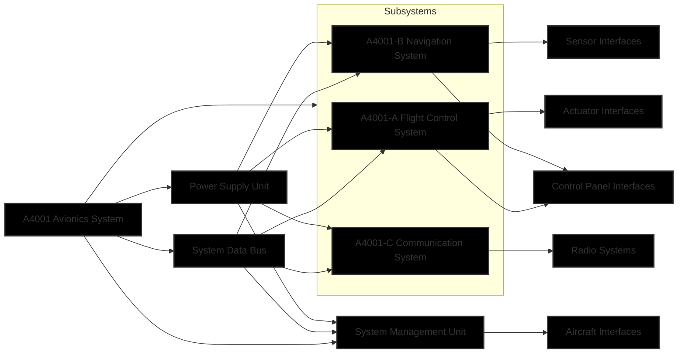
```mermaid
graph LR
    A["A4001 Avionics System"]:::main
    subgraph Subsystems
        B["A4001-A Flight Control System"]:::sub
        C["A4001-B Navigation System"]:::sub
        D["A4001-C Communication System"]:::sub
    end
    E["System Data Bus"]:::support
    F["Power Supply Unit"]:::support
    G["System Management Unit"]:::support
    H["Actuator Interfaces"]:::int
    I["Sensor Interfaces"]:::int
    J["Control Panel Interfaces"]:::int
    K["Radio Systems"]:::int
    L["Aircraft Interfaces"]:::int

    A --> Subsystems
    A --> E
    A --> F
    A --> G

    E --> B
    E --> C
    E --> D
    E --> G

    F --> B
    F --> C
    F --> D
    F --> G

    B --> H
    C --> I
    B --> J
    C --> J
    D --> K
    G --> L

    classDef main fill:#f96,stroke:#333,stroke-width:2px,fill:#000;
    classDef sub fill:#69f,stroke:#333,stroke-width:2px,fill:#000;
    classDef support fill:#9f6,stroke:#333,stroke-width:2px,fill:#000;
    classDef int fill:#f9f,stroke:#333,stroke-width:2px,fill:#000;
```

## C.3 Hardware Architecture

### C.3.1 Physical Component Layout

The following diagram shows the physical layout of the A4001 Avionics System components:

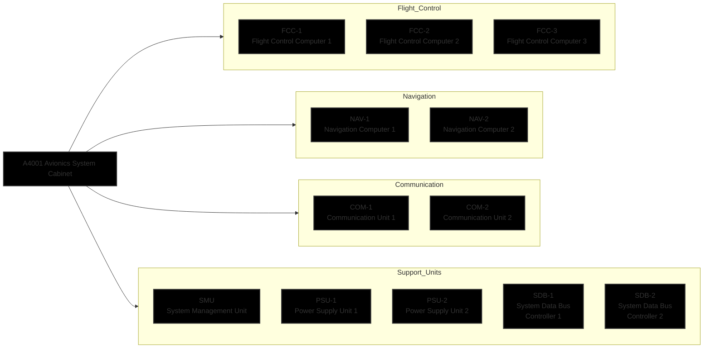
```mermaid
graph LR
    A["A4001 Avionics System Cabinet"]:::cabinet
    subgraph Flight_Control
        B["FCC-1 \n Flight Control Computer 1"]:::fcc
        C["FCC-2 \n Flight Control Computer 2"]:::fcc
        D["FCC-3 \n Flight Control Computer 3"]:::fcc
    end
    subgraph Navigation
        E["NAV-1 \n Navigation Computer 1"]:::nav
        F["NAV-2 \n Navigation Computer 2"]:::nav
    end
    subgraph Communication
        G["COM-1 \n Communication Unit 1"]:::com
        H["COM-2 \n Communication Unit 2"]:::com
    end
    subgraph Support_Units
        I["SMU \n System Management Unit"]:::support
        J["PSU-1 \n Power Supply Unit 1"]:::support
        K["PSU-2 \n Power Supply Unit 2"]:::support
        L["SDB-1 \n System Data Bus<br>Controller 1"]:::support
        M["SDB-2 \n System Data Bus<br>Controller 2"]:::support
    end
    A --> Flight_Control
    A --> Navigation
    A --> Communication
    A --> Support_Units

    classDef cabinet fill:#f96,stroke:#333,stroke-width:2px,fill:#000;
    classDef fcc fill:#69f,stroke:#333,stroke-width:2px,fill:#000;
    classDef nav fill:#69f,stroke:#333,stroke-width:2px,fill:#000;
    classDef com fill:#9f6,stroke:#333,stroke-width:2px,fill:#000;
    classDef support fill:#f9f,stroke:#333,stroke-width:2px,fill:#000;
```

### C.3.2 Hardware Interconnection Diagram

The following diagram illustrates the hardware interconnections between the A4001 Avionics System components:

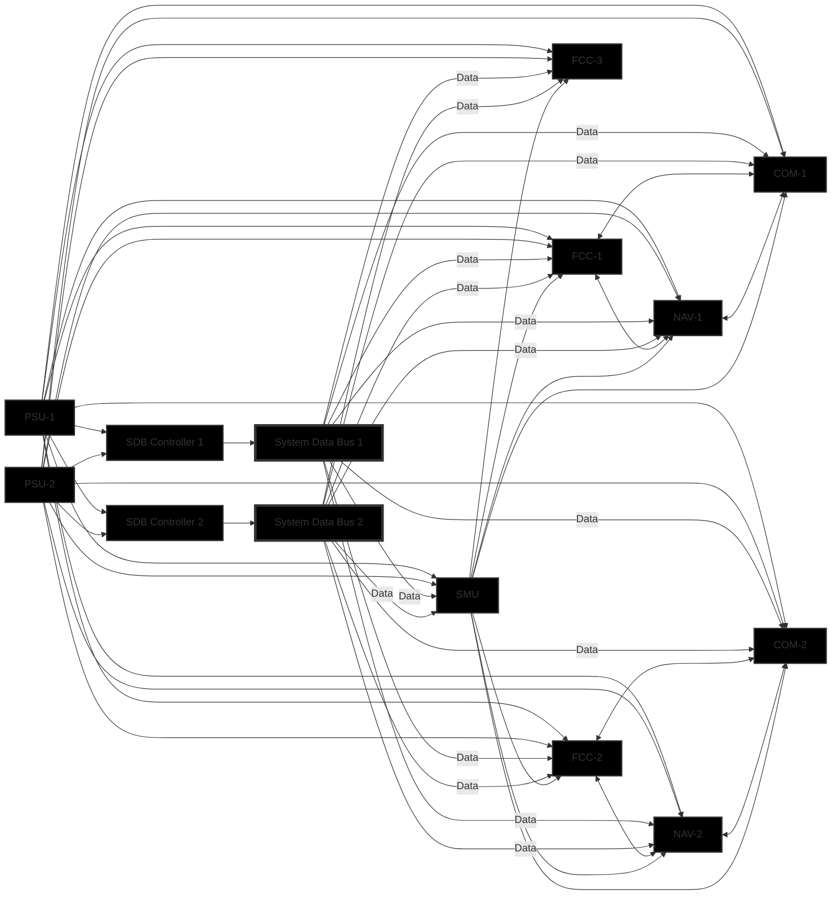
```mermaid
graph LR
    SDB1["System Data Bus 1"]:::bus
    SDB2["System Data Bus 2"]:::bus
    FCC1["FCC-1"]:::comp
    FCC2["FCC-2"]:::comp
    FCC3["FCC-3"]:::comp
    NAV1["NAV-1"]:::comp
    NAV2["NAV-2"]:::comp
    COM1["COM-1"]:::comp
    COM2["COM-2"]:::comp
    SMU["SMU"]:::comp
    PSU1["PSU-1"]:::power
    PSU2["PSU-2"]:::power
    SDB_C1["SDB Controller 1"]:::comp
    SDB_C2["SDB Controller 2"]:::comp

    PSU1 --> FCC1
    PSU1 --> FCC2
    PSU1 --> FCC3
    PSU1 --> NAV1
    PSU1 --> NAV2
    PSU1 --> COM1
    PSU1 --> COM2
    PSU1 --> SMU
    PSU1 --> SDB_C1
    PSU1 --> SDB_C2

    PSU2 --> FCC1
    PSU2 --> FCC2
    PSU2 --> FCC3
    PSU2 --> NAV1
    PSU2 --> NAV2
    PSU2 --> COM1
    PSU2 --> COM2
    PSU2 --> SMU
    PSU2 --> SDB_C1
    PSU2 --> SDB_C2

    SDB_C1 --> SDB1
    SDB_C2 --> SDB2

    SDB1 -- Data --> FCC1
    SDB1 -- Data --> FCC2
    SDB1 -- Data --> FCC3
    SDB1 -- Data --> NAV1
    SDB1 -- Data --> NAV2
    SDB1 -- Data --> COM1
    SDB1 -- Data --> COM2
    SDB1 -- Data --> SMU

    SDB2 -- Data --> FCC1
    SDB2 -- Data --> FCC2
    SDB2 -- Data --> FCC3
    SDB2 -- Data --> NAV1
    SDB2 -- Data --> NAV2
    SDB2 -- Data --> COM1
    SDB2 -- Data --> COM2
    SDB2 -- Data --> SMU

    FCC1 <--> NAV1
    FCC1 <--> COM1
    NAV1 <--> COM1

    FCC2 <--> NAV2
    FCC2 <--> COM2
    NAV2 <--> COM2

    SMU --> FCC1
    SMU --> FCC2
    SMU --> FCC3
    SMU --> NAV1
    SMU --> NAV2
    SMU --> COM1
    SMU --> COM2

    classDef bus fill:#f96,stroke:#333,stroke-width:4px,fill:#000;
    classDef comp fill:#69f,stroke:#333,stroke-width:2px,fill:#000;
    classDef power fill:#9f6,stroke:#333,stroke-width:2px,fill:#000;
```

## C.4 Subsystem Architectures

### C.4.1 Flight Control System Architecture

The following diagram shows the architecture of the A4001-A Flight Control System:

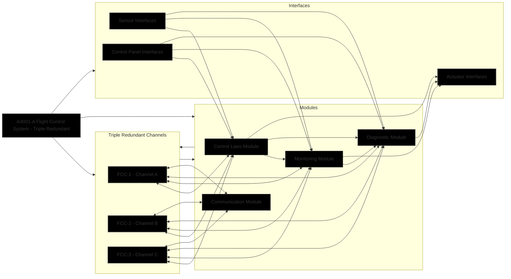
```mermaid
graph LR
    FCS["A4001-A Flight Control System - Triple Redundant"]:::fcs
    subgraph TRC["Triple Redundant Channels"]
        FCC1["FCC-1 - Channel A"]:::fcc
        FCC2["FCC-2 - Channel B"]:::fcc
        FCC3["FCC-3 - Channel C"]:::fcc
    end
    subgraph Modules
        CLM["Control Laws Module"]:::fcm
        MM["Monitoring Module"]:::fcm
        DM["Diagnostic Module"]:::fcm
        CoM["Communication Module"]:::fcm
    end
    subgraph Interfaces
        Act["Actuator Interfaces"]:::int
        Sens["Sensor Interfaces"]:::int
        CP["Control Panel Interfaces"]:::int
    end

    FCS --> TRC
    FCS --> Modules
    FCS --> Interfaces

    TRC --> Modules
    Modules --> TRC

    CLM --> MM
    CLM --> DM
    MM --> DM

    FCC1 <--> CLM
    FCC1 <--> MM
    FCC1 <--> DM
    FCC1 <--> CoM

    FCC2 <--> CLM
    FCC2 <--> MM
    FCC2 <--> DM
    FCC2 <--> CoM

    FCC3 <--> CLM
    FCC3 <--> MM
    FCC3 <--> DM
    FCC3 <--> CoM

    CLM --> Act
    MM --> Act
    DM --> Act

    Sens --> CLM
    Sens --> MM
    Sens --> DM

    CP --> CLM
    CP --> MM
    CP --> DM

    classDef fcs fill:#f96,stroke:#333,stroke-width:2px,fill:#000;
    classDef fcc fill:#69f,stroke:#333,stroke-width:2px,fill:#000;
    classDef fcm fill:#9f6,stroke:#333,stroke-width:1px,fill:#000;
    classDef int fill:#f9f,stroke:#333,stroke-width:2px,fill:#000;
```

### C.4.2 Navigation System Architecture

The following diagram shows the architecture of the A4001-B Navigation System:

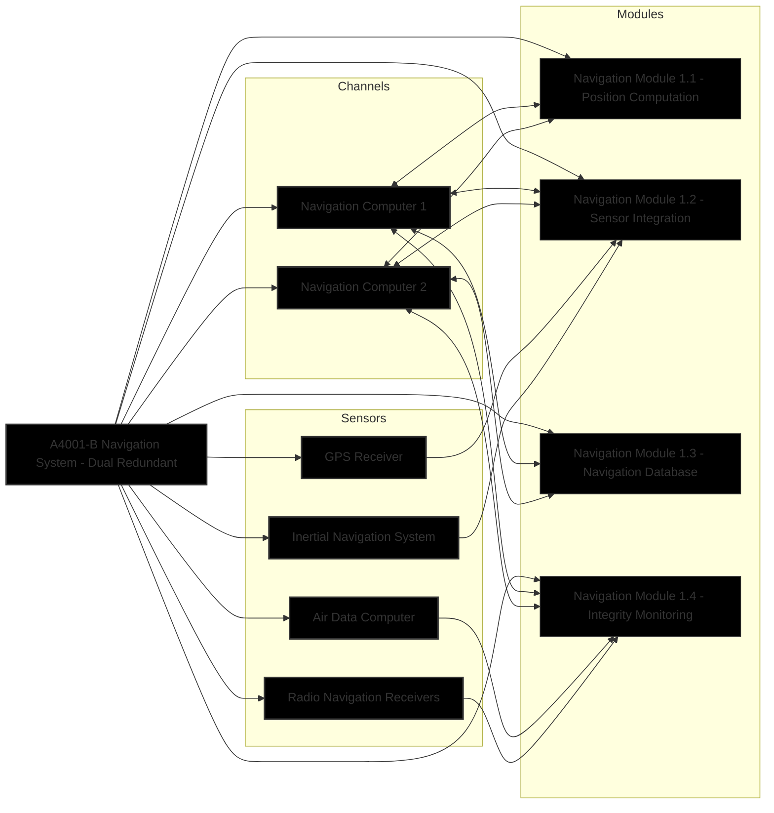
```mermaid
graph LR
    NS["A4001-B Navigation System - Dual Redundant"]:::ns
    subgraph Channels
        Nav1["Navigation Computer 1"]:::nav
        Nav2["Navigation Computer 2"]:::nav
    end
    subgraph Modules
        NM1["Navigation Module 1.1 - Position Computation"]:::nm
        NM2["Navigation Module 1.2 - Sensor Integration"]:::nm
        NM3["Navigation Module 1.3 - Navigation Database"]:::nm
        NM4["Navigation Module 1.4 - Integrity Monitoring"]:::nm
    end
    subgraph Sensors
        GPS["GPS Receiver"]:::sens
        INS["Inertial Navigation System"]:::sens
        ADC["Air Data Computer"]:::sens
        RNR["Radio Navigation Receivers"]:::sens
    end

    NS --> Nav1
    NS --> Nav2
    NS --> NM1
    NS --> NM2
    NS --> NM3
    NS --> NM4
    NS --> GPS
    NS --> INS
    NS --> ADC
    NS --> RNR

    Nav1 <--> NM1
    Nav1 <--> NM2
    Nav1 <--> NM3
    Nav1 <--> NM4

    Nav2 <--> NM1
    Nav2 <--> NM2
    Nav2 <--> NM3
    Nav2 <--> NM4

    GPS --> NM2
    INS --> NM2
    ADC --> NM4
    RNR --> NM4

    classDef ns fill:#f96,stroke:#333,stroke-width:2px,fill:#000;
    classDef nav fill:#69f,stroke:#333,stroke-width:2px,fill:#000;
    classDef nm fill:#9f6,stroke:#333,stroke-width:1px,fill:#000;
    classDef sens fill:#f9f,stroke:#333,stroke-width:2px,fill:#000;
```

### C.4.3 Communication System Architecture

The following diagram shows the architecture of the A4001-C Communication System:

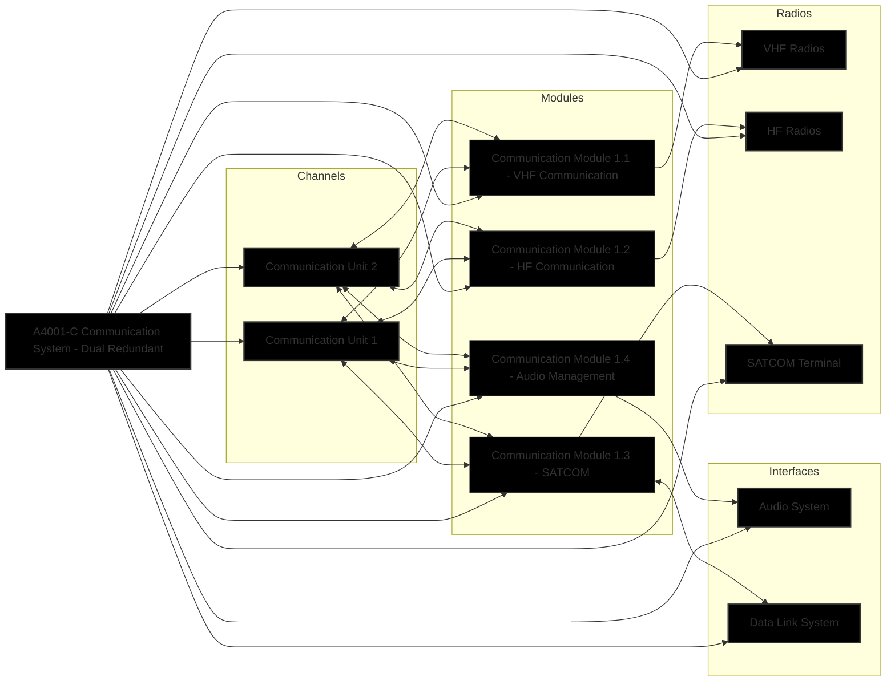
```mermaid
graph LR
    CS["A4001-C Communication System - Dual Redundant"]:::cs
    subgraph Channels
        Com1["Communication Unit 1"]:::com
        Com2["Communication Unit 2"]:::com
    end
    subgraph Modules
        CM1["Communication Module 1.1 - VHF Communication"]:::cm
        CM2["Communication Module 1.2 - HF Communication"]:::cm
        CM3["Communication Module 1.3 - SATCOM"]:::cm
        CM4["Communication Module 1.4 - Audio Management"]:::cm
    end
     subgraph Radios
        VHF["VHF Radios"]:::rad
        HF["HF Radios"]:::rad
        SATCOM["SATCOM Terminal"]:::rad
     end
     subgraph Interfaces
        Audio["Audio System"]:::rad
        DataLink["Data Link System"]:::rad
     end

    CS --> Com1
    CS --> Com2
    CS --> CM1
    CS --> CM2
    CS --> CM3
    CS --> CM4
    CS --> VHF
    CS --> HF
    CS --> SATCOM
    CS --> Audio
    CS --> DataLink

    Com1 <--> CM1
    Com1 <--> CM2
    Com1 <--> CM3
    Com1 <--> CM4

    Com2 <--> CM1
    Com2 <--> CM2
    Com2 <--> CM3
    Com2 <--> CM4

    CM1 --> VHF
    CM2 --> HF
    CM3 --> SATCOM
    CM4 --> Audio
    CM3 <--> DataLink

    classDef cs fill:#f96,stroke:#333,stroke-width:2px,fill:#000;
    classDef com fill:#69f,stroke:#333,stroke-width:2px,fill:#000;
    classDef cm fill:#9f6,stroke:#333,stroke-width:1px,fill:#000;
    classDef rad fill:#f9f,stroke:#333,stroke-width:2px,fill:#000;
```

## C.5 Software Architecture

### C.5.1 Software Layer Architecture

The following diagram illustrates the layered software architecture used in the A4001 Avionics System:

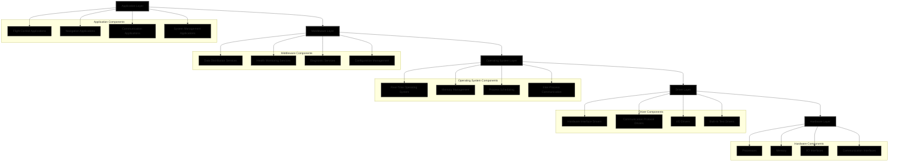
```mermaid
graph TD
    AppLayer["Application Layer"]:::layer
    MidLayer["Middleware Layer"]:::layer
    OSLayer["Operating System Layer"]:::layer
    DriverLayer["Driver Layer"]:::layer
    HwLayer["Hardware Layer"]:::layer

    AppLayer --> MidLayer
    MidLayer --> OSLayer
    OSLayer --> DriverLayer
    DriverLayer --> HwLayer

    subgraph "Application Components"
        FCApp["Flight Control Applications"]:::comp
        NavApp["Navigation Applications"]:::comp
        CommApp["Communication Applications"]:::comp
        SysManApp["System Management Applications"]:::comp
    end

    subgraph "Middleware Components"
        DataDist["Data Distribution Services"]:::comp
        HealthMon["Health Monitoring Services"]:::comp
        Diag["Diagnostic Services"]:::comp
        ConfigMan["Configuration Management"]:::comp
    end

    subgraph "Operating System Components"
        RTOS["Real-Time Operating System"]:::comp
        MemMan["Memory Management"]:::comp
        ProcSched["Process Scheduling"]:::comp
        IPC["Inter-Process Communication"]:::comp
    end

    subgraph "Driver Components"
        HwInt["Hardware Interface Drivers"]:::comp
        CommProt["Communication Protocol Drivers"]:::comp
        IODrivers["I/O Drivers"]:::comp
        BITDrivers["Built-In Test Drivers"]:::comp
    end

    subgraph "Hardware Components"
        Processors["Processors"]:::comp
        Memory["Memory"]:::comp
        IOInt["I/O Interfaces"]:::comp
        CommInt["Communication Interfaces"]:::comp
    end

    AppLayer --> FCApp
    AppLayer --> NavApp
    AppLayer --> CommApp
    AppLayer --> SysManApp

    MidLayer --> DataDist
    MidLayer --> HealthMon
    MidLayer --> Diag
    MidLayer --> ConfigMan

    OSLayer --> RTOS
    OSLayer --> MemMan
    OSLayer --> ProcSched
    OSLayer --> IPC

    DriverLayer --> HwInt
    DriverLayer --> CommProt
    DriverLayer --> IODrivers
    DriverLayer --> BITDrivers

    HwLayer --> Processors
    HwLayer --> Memory
    HwLayer --> IOInt
    HwLayer --> CommInt

    classDef layer fill:#f96,stroke:#333,stroke-width:4px,fill:#000;
    classDef comp fill:#69f,stroke:#333,stroke-width:2px,fill:#000;
```

### C.5.2 Flight Control Software Architecture

The following diagram shows the software architecture of the Flight Control System:

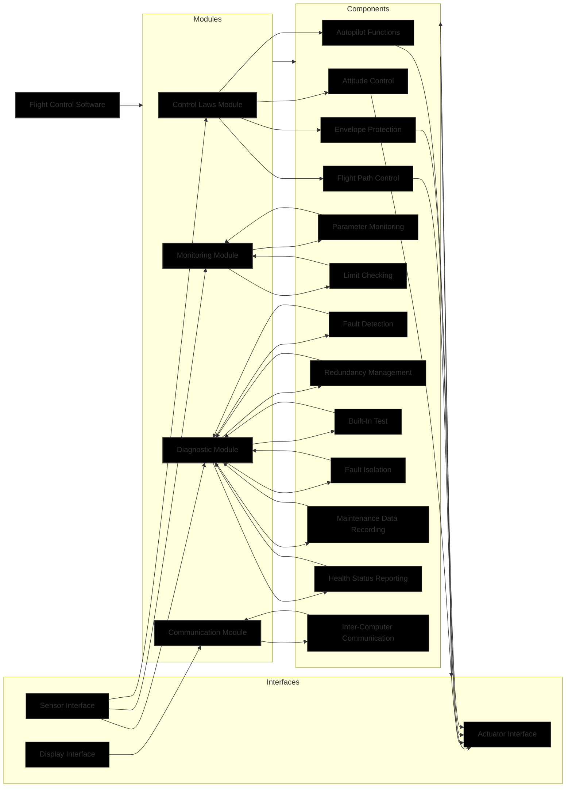
```mermaid
graph LR
    FCS["Flight Control Software"]:::main
    subgraph Modules
        CLM["Control Laws Module"]:::module
        MM["Monitoring Module"]:::module
        DM["Diagnostic Module"]:::module
        CoM["Communication Module"]:::module
    end
    subgraph Components
        AC["Attitude Control"]:::comp
        FPC["Flight Path Control"]:::comp
        EP["Envelope Protection"]:::comp
        AP["Autopilot Functions"]:::comp
        PM["Parameter Monitoring"]:::comp
        LC["Limit Checking"]:::comp
        FD["Fault Detection"]:::comp
        RM["Redundancy Management"]:::comp
        BIT["Built-In Test"]:::comp
        FI["Fault Isolation"]:::comp
        MR["Maintenance Data Recording"]:::comp
        HS["Health Status Reporting"]:::comp
        ICC["Inter-Computer Communication"]:::comp
    end
     subgraph Interfaces
        ActuatorI["Actuator Interface"]:::comp
        SensorI["Sensor Interface"]:::comp
        DisplayI["Display Interface"]:::comp
     end


    FCS --> Modules
    Modules --> Components
    Components --> Interfaces
    Interfaces --> Components

    CLM --> AC
    CLM --> FPC
    CLM --> EP
    CLM --> AP

    MM --> PM
    MM --> LC

    DM --> FD
    DM --> RM
    DM --> BIT
    DM --> FI
    DM --> MR
    DM --> HS

    CoM --> ICC

    AC --> ActuatorI
    FPC --> ActuatorI
    EP --> ActuatorI
    AP --> ActuatorI

    PM --> MM
    LC --> MM
    FD --> DM
    RM --> DM
    BIT --> DM
    FI --> DM
    MR --> DM
    HS --> DM
    ICC --> CoM

    SensorI --> CLM
    SensorI --> MM
    SensorI --> DM

    DisplayI --> CoM


    classDef main fill:#f96,stroke:#333,stroke-width:2px,fill:#000;
    classDef module fill:#69f,stroke:#333,stroke-width:2px,fill:#000;
    classDef comp fill:#9f6,stroke:#333,stroke-width:1px,fill:#000;
```

### C.5.3 Navigation Software Architecture

The following diagram shows the software architecture of the Navigation System:

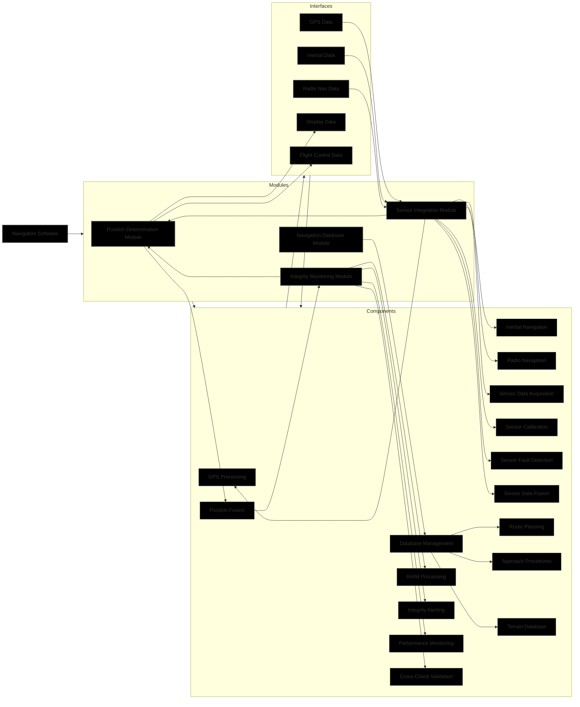
```mermaid
graph LR
    NS["Navigation Software"]:::main
    subgraph Modules
        PDM["Position Determination Module"]:::module
        SIM["Sensor Integration Module"]:::module
        NDM["Navigation Database Module"]:::module
        IMM["Integrity Monitoring Module"]:::module
    end
    subgraph Components
        GPSProc["GPS Processing"]:::comp
        INSProc["Inertial Navigation"]:::comp
        RNRProc["Radio Navigation"]:::comp
        PosFusion["Position Fusion"]:::comp
        SensorAcq["Sensor Data Acquisition"]:::comp
        SensorCal["Sensor Calibration"]:::comp
        SensorFD["Sensor Fault Detection"]:::comp
        SensorFusion["Sensor Data Fusion"]:::comp
        DBMan["Database Management"]:::comp
        RP["Route Planning"]:::comp
        AP["Approach Procedures"]:::comp
        TD["Terrain Database"]:::comp
        RAIM["RAIM Processing"]:::comp
        IntAlert["Integrity Alerting"]:::comp
        PerfMon["Performance Monitoring"]:::comp
        CrossCheck["Cross-Check Validation"]:::comp
    end
    subgraph Interfaces
        GPSI["GPS Data"]:::input
        INSData["Inertial Data"]:::input
        RNRData["Radio Nav Data"]:::input
        DisplayOut["Display Data"]:::out
        FCOut["Flight Control Data"]:::out
    end


    NS --> Modules
    Modules --> Components
    Components --> Interfaces
    Interfaces --> Components

    SIM --> GPSProc
    SIM --> INSProc
    SIM --> RNRProc
    SIM --> SensorAcq
    SIM --> SensorCal
    SIM --> SensorFD
    SIM --> SensorFusion

    GPSI --> SIM
    INSData --> SIM
    RNRData --> SIM

    SIM --> PDM
    PDM --> PosFusion

    NDM --> DBMan
    DBMan --> RP
    DBMan --> AP
    DBMan --> TD

    IMM --> RAIM
    IMM --> IntAlert
    IMM --> PerfMon
    IMM --> CrossCheck

    PosFusion --> IMM
    IMM --> PDM

    PDM --> DisplayOut
    PDM --> FCOut

    classDef main fill:#f96,stroke:#333,stroke-width:2px,fill:#000;
    classDef module fill:#69f,stroke:#333,stroke-width:2px,fill:#000;
    classDef comp fill:#9f6,stroke:#333,stroke-width:1px,fill:#000;
    classDef input fill:#f9f,stroke:#333,stroke-width:2px,fill:#000;
    classDef out fill:#9f6,stroke:#333,stroke-width:2px,fill:#000;
```

### C.5.4 Communication Software Architecture

The following diagram shows the software architecture of the Communication System:

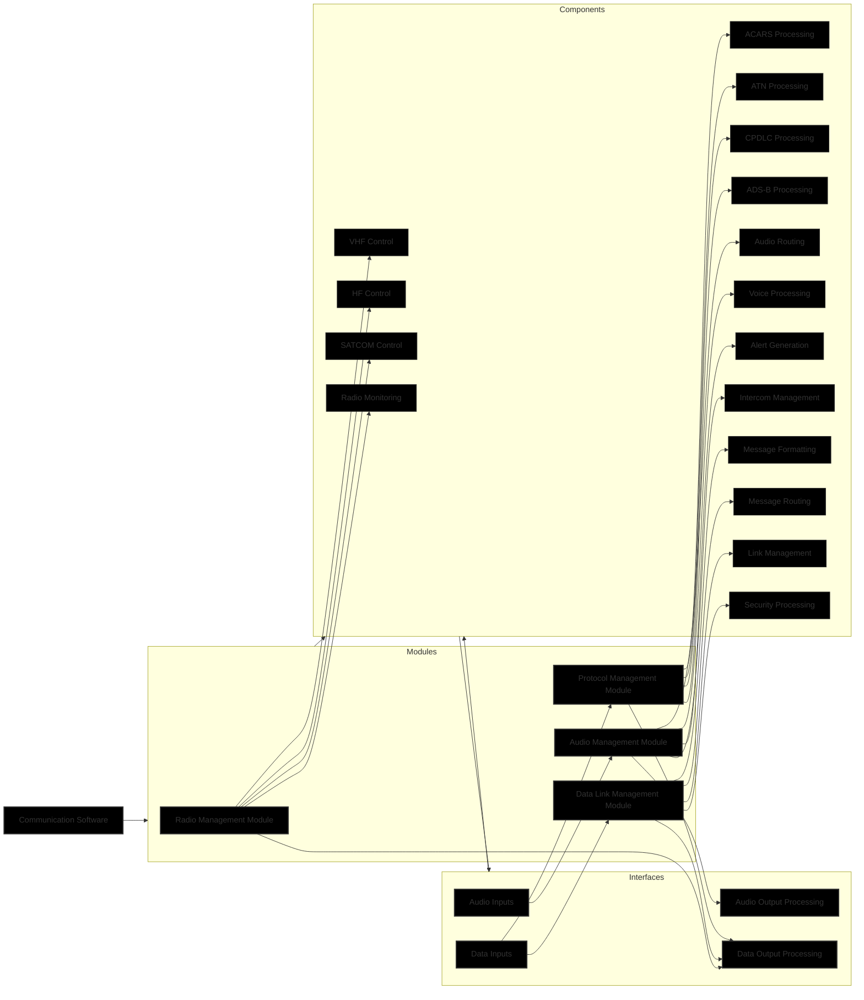
```mermaid
graph LR
    CS["Communication Software"]:::main
    subgraph Modules
        RMM["Radio Management Module"]:::module
        PM["Protocol Management Module"]:::module
        AMM["Audio Management Module"]:::module
        DLM["Data Link Management Module"]:::module
    end
    subgraph Components
        VHF["VHF Control"]:::comp
        HF["HF Control"]:::comp
        SATCOM["SATCOM Control"]:::comp
        RM["Radio Monitoring"]:::comp
        AP["ACARS Processing"]:::comp
        ATN["ATN Processing"]:::comp
        CPDLC["CPDLC Processing"]:::comp
        ADSB["ADS-B Processing"]:::comp
        AR["Audio Routing"]:::comp
        VP["Voice Processing"]:::comp
        AG["Alert Generation"]:::comp
        IM["Intercom Management"]:::comp
        MF["Message Formatting"]:::comp
        MR["Message Routing"]:::comp
        LM["Link Management"]:::comp
        SP["Security Processing"]:::comp
    end
     subgraph Interfaces
        AudioIn["Audio Inputs"]:::input
        DataIn["Data Inputs"]:::input
        AudioOut["Audio Output Processing"]:::out
        DataOut["Data Output Processing"]:::out
     end

    CS --> Modules
    Modules --> Components
    Components --> Interfaces
    Interfaces --> Components

    RMM --> VHF
    RMM --> HF
    RMM --> SATCOM
    RMM --> RM

    PM --> AP
    PM --> ATN
    PM --> CPDLC
    PM --> ADSB

    AMM --> AR
    AMM --> VP
    AMM --> AG
    AMM --> IM

    DLM --> MF
    DLM --> MR
    DLM --> LM
    DLM --> SP


    AudioIn --> AMM
    DataIn --> PM
    DataIn --> DLM

    AMM --> AudioOut
    PM --> DataOut
    DLM --> DataOut
    RMM --> DataOut


    classDef main fill:#f96,stroke:#333,stroke-width:2px,fill:#000;
    classDef module fill:#69f,stroke:#333,stroke-width:2px,fill:#000;
    classDef comp fill:#9f6,stroke:#333,stroke-width:1px,fill:#000;
    classDef input fill:#f9f,stroke:#333,stroke-width:2px,fill:#000;
    classDef out fill:#9f6,stroke:#333,stroke-width:2px,fill:#000;
```

## C.6 Redundancy Architecture

### C.6.1 System Redundancy Overview

The following diagram provides an overview of the redundancy architecture in the A4001 Avionics System:

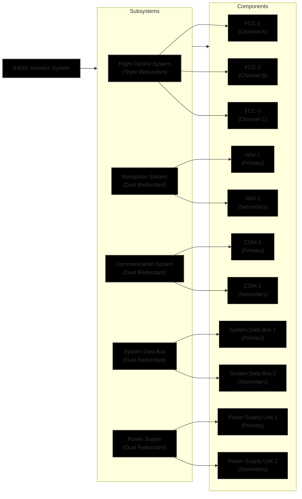
```mermaid
graph LR
    A["A4001 Avionics System"]:::system
    subgraph Subsystems
        FC["Flight Control System\n(Triple Redundant)"]:::triple
        NS["Navigation System\n(Dual Redundant)"]:::dual
        CS["Communication System\n(Dual Redundant)"]:::dual
        SDB["System Data Bus\n(Dual Redundant)"]:::dual
        PSU["Power Supply\n(Dual Redundant)"]:::dual
    end
     subgraph Components
        FCC1["FCC-1\n(Channel A)"]:::comp
        FCC2["FCC-2\n(Channel B)"]:::comp
        FCC3["FCC-3\n(Channel C)"]:::comp
        NAV1["NAV-1\n(Primary)"]:::comp
        NAV2["NAV-2\n(Secondary)"]:::comp
        COM1["COM-1\n(Primary)"]:::comp
        COM2["COM-2\n(Secondary)"]:::comp
        SDB1["System Data Bus 1\n(Primary)"]:::comp
        SDB2["System Data Bus 2\n(Secondary)"]:::comp
        PSU1["Power Supply Unit 1\n(Primary)"]:::comp
        PSU2["Power Supply Unit 2\n(Secondary)"]:::comp
     end

    A --> Subsystems
    Subsystems --> Components

    FC --> FCC1
    FC --> FCC2
    FC --> FCC3

    NS --> NAV1
    NS --> NAV2

    CS --> COM1
    CS --> COM2

    SDB --> SDB1
    SDB --> SDB2

    PSU --> PSU1
    PSU --> PSU2


    classDef system fill:#f96,stroke:#333,stroke-width:2px,fill:#000;
    classDef triple fill:#69f,stroke:#333,stroke-width:2px,fill:#000;
    classDef dual fill:#9f6,stroke:#333,stroke-width:2px,fill:#000;
    classDef comp fill:#f9f,stroke:#333,stroke-width:1px,fill:#000;
```

### C.6.2 Flight Control System Redundancy

The following diagram illustrates the redundancy architecture of the Flight Control System:

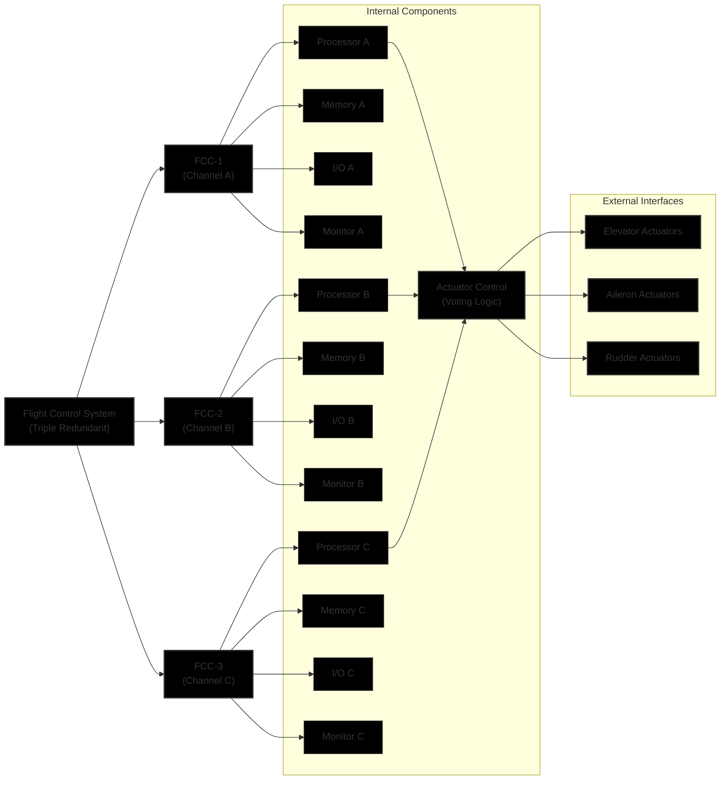
```mermaid
graph LR
    FCS["Flight Control System\n(Triple Redundant)"]:::fcs
    FCC1["FCC-1\n(Channel A)"]:::fcc
    FCC2["FCC-2\n(Channel B)"]:::fcc
    FCC3["FCC-3\n(Channel C)"]:::fcc
    subgraph "Internal Components"
        ProcA["Processor A"]:::comp
        MemA["Memory A"]:::comp
        IOA["I/O A"]:::comp
        MonA["Monitor A"]:::comp
        ProcB["Processor B"]:::comp
        MemB["Memory B"]:::comp
        IOB["I/O B"]:::comp
        MonB["Monitor B"]:::comp
        ProcC["Processor C"]:::comp
        MemC["Memory C"]:::comp
        IOC["I/O C"]:::comp
        MonC["Monitor C"]:::comp
        ACL["Actuator Control\n(Voting Logic)"]:::act
    end
     subgraph "External Interfaces"
        Elev["Elevator Actuators"]:::act
        Ail["Aileron Actuators"]:::act
        Rud["Rudder Actuators"]:::act
     end


    FCS --> FCC1
    FCS --> FCC2
    FCS --> FCC3

    FCC1 --> ProcA
    FCC1 --> MemA
    FCC1 --> IOA
    FCC1 --> MonA

    FCC2 --> ProcB
    FCC2 --> MemB
    FCC2 --> IOB
    FCC2 --> MonB

    FCC3 --> ProcC
    FCC3 --> MemC
    FCC3 --> IOC
    FCC3 --> MonC

    ProcA --> ACL
    ProcB --> ACL
    ProcC --> ACL

    ACL --> Elev
    ACL --> Ail
    ACL --> Rud

    classDef fcs fill:#f96,stroke:#333,stroke-width:2px,fill:#000;
    classDef fcc fill:#69f,stroke:#333,stroke-width:2px,fill:#000;
    classDef comp fill:#9f6,stroke:#333,stroke-width:1px,fill:#000;
    classDef act fill:#f9f,stroke:#333,stroke-width:2px,fill:#000;
```

### C.6.3 Voting Logic Architecture

The following diagram shows the voting logic architecture used in the Flight Control System:

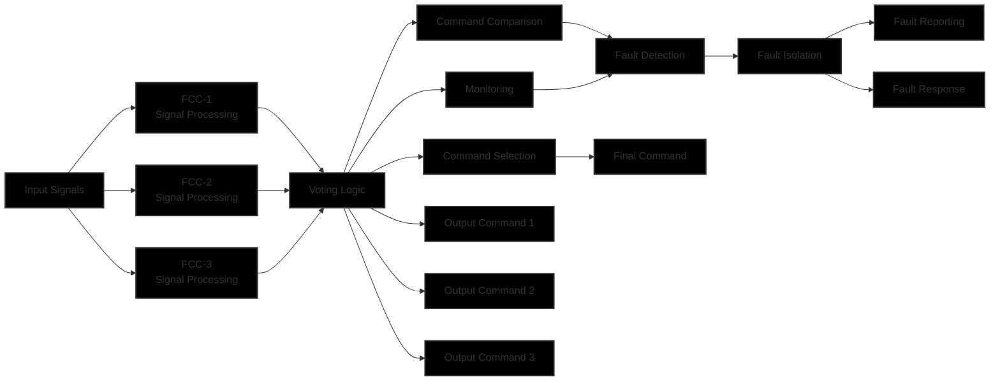
```mermaid
graph LR
    Inputs["Input Signals"]:::input --> FCC1_Proc["FCC-1 \n Signal Processing"]:::proc
    Inputs --> FCC2_Proc["FCC-2 \n Signal Processing"]:::proc
    Inputs --> FCC3_Proc["FCC-3 \n Signal Processing"]:::proc
    FCC1_Proc --> Vote["Voting Logic"]:::vote
    FCC2_Proc --> Vote
    FCC3_Proc --> Vote
    Vote --> Comp["Command Comparison"]:::vote
    Vote --> Sel["Command Selection"]:::vote
    Vote --> Mon["Monitoring"]:::vote
    Comp --> FaultDet["Fault Detection"]:::vote
    Sel --> FinalCmd["Final Command"]:::cmd
    Mon --> FaultDet
    FaultDet --> FI["Fault Isolation"]:::type
    FI --> FR["Fault Reporting"]:::action
    FI --> FResp["Fault Response"]:::action
    Vote --> Cmd1["Output Command 1"]:::out
    Vote --> Cmd2["Output Command 2"]:::out
    Vote --> Cmd3["Output Command 3"]:::out

    classDef input fill:#f96,stroke:#333,stroke-width:2px,fill:#000;
    classDef proc fill:#69f,stroke:#333,stroke-width:2px,fill:#000;
    classDef out fill:#9f6,stroke:#333,stroke-width:2px,fill:#000;
    classDef vote fill:#f9f,stroke:#333,stroke-width:2px,fill:#000;
    classDef cmd fill:#f69,stroke:#333,stroke-width:2px,fill:#000;
    classDef type fill:#69f,stroke:#333,stroke-width:2px,fill:#000;
    classDef action fill:#f9f,stroke:#333,stroke-width:2px,fill:#000;
```

## C.7 Data Flow Architecture

### C.7.1 System-Level Data Flow

The following diagram illustrates the high-level data flow in the A4001 Avionics System:

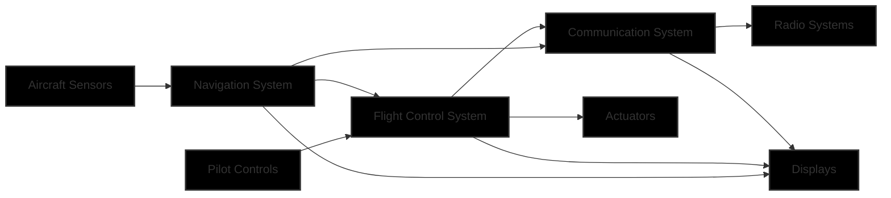
```mermaid
graph LR
    Sens["Aircraft Sensors"]:::input --> Nav["Navigation System"]:::system
    Pilot["Pilot Controls"]:::input --> FC["Flight Control System"]:::system
    Nav --> FC
    Nav --> Disp["Displays"]:::output
    Nav --> Comm["Communication System"]:::system
    FC --> Act["Actuators"]:::output
    FC --> Comm
    FC --> Disp
    Comm --> Radio["Radio Systems"]:::output
    Comm --> Disp

    classDef input fill:#f96,stroke:#333,stroke-width:2px,fill:#000;
    classDef system fill:#69f,stroke:#333,stroke-width:2px,fill:#000;
    classDef output fill:#9f6,stroke:#333,stroke-width:2px,fill:#000;
```

### C.7.2 Flight Control System Data Flow

The following diagram shows the data flow within the Flight Control System:

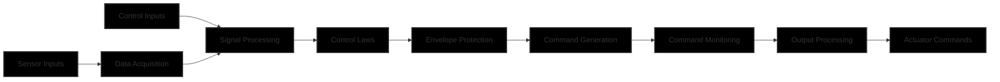
```mermaid
graph LR
    SensorIn["Sensor Inputs"]:::input --> DA["Data Acquisition"]:::proc
    ControlIn["Control Inputs"]:::input --> SP["Signal Processing"]:::proc
    DA --> SP
    SP --> CL["Control Laws"]:::proc
    CL --> EP["Envelope Protection"]:::proc
    EP --> CG["Command Generation"]:::proc
    CG --> CM["Command Monitoring"]:::proc
    CM --> OP["Output Processing"]:::proc
    OP --> ActuatorCommands["Actuator Commands"]:::out

    classDef input fill:#f96,stroke:#333,stroke-width:2px,fill:#000;
    classDef proc fill:#69f,stroke:#333,stroke-width:2px,fill:#000;
    classDef out fill:#9f6,stroke:#333,stroke-width:2px,fill:#000;
```

### C.7.3 Navigation System Data Flow

The following diagram shows the data flow within the Navigation System:

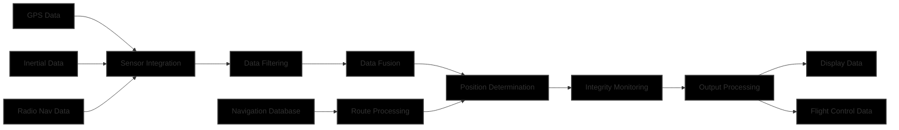
```mermaid
graph LR
    GPSData["GPS Data"]:::input --> SensorIntegration["Sensor Integration"]:::proc
    InertialData["Inertial Data"]:::input --> SensorIntegration
    RadioNavData["Radio Nav Data"]:::input --> SensorIntegration
    SensorIntegration --> DataFiltering["Data Filtering"]:::proc
    DataFiltering --> DataFusion["Data Fusion"]:::proc
    DataFusion --> PositionDetermination["Position Determination"]:::proc
    NavigationDatabase["Navigation Database"]:::proc --> RouteProcessing["Route Processing"]:::proc
    RouteProcessing --> PositionDetermination
    PositionDetermination --> IntegrityMonitoring["Integrity Monitoring"]:::proc
    IntegrityMonitoring --> OutputProcessing["Output Processing"]:::proc
    OutputProcessing --> DisplayData["Display Data"]:::out
    OutputProcessing --> FlightControlData["Flight Control Data"]:::out

    classDef input fill:#f96,stroke:#333,stroke-width:2px,fill:#000;
    classDef proc fill:#69f,stroke:#333,stroke-width:2px,fill:#000;
    classDef out fill:#9f6,stroke:#333,stroke-width:2px,fill:#000;
```

### C.7.4 Communication System Data Flow

The following diagram shows the data flow within the Communication System:

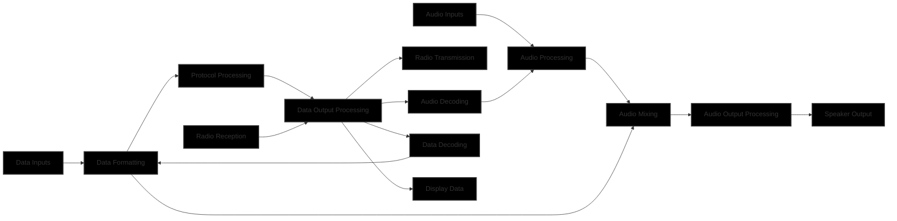
```mermaid
graph LR
    AudioInputs["Audio Inputs"]:::input --> AudioProcessing["Audio Processing"]:::proc
    DataInputs["Data Inputs"]:::input --> DataFormatting["Data Formatting"]:::proc
    AudioProcessing --> AudioMixing["Audio Mixing"]:::proc
    DataFormatting --> AudioMixing
    AudioMixing --> AudioOutputProcessing["Audio Output Processing"]:::proc
    DataFormatting --> ProtocolProcessing["Protocol Processing"]:::proc
    ProtocolProcessing --> DataOutputProcessing["Data Output Processing"]:::proc
    AudioOutputProcessing --> SpeakerOutput["Speaker Output"]:::out
    DataOutputProcessing --> RadioTransmission["Radio Transmission"]:::out
    RadioReception["Radio Reception"]:::input --> DataOutputProcessing
    DataOutputProcessing --> AudioDecoding["Audio Decoding"]:::proc
    DataOutputProcessing --> DataDecoding["Data Decoding"]:::proc
    AudioDecoding --> AudioProcessing
    DataDecoding --> DataFormatting
    DataOutputProcessing --> DisplayData["Display Data"]:::out

    classDef input fill:#f96,stroke:#333,stroke-width:2px,fill:#000;
    classDef proc fill:#69f,stroke:#333,stroke-width:2px,fill:#000;
    classDef out fill:#9f6,stroke:#333,stroke-width:2px,fill:#000;
```

## C.8 Fault Management Architecture

### C.8.1 Fault Detection and Isolation

The following diagram illustrates the fault detection and isolation architecture in the A4001 Avionics System:

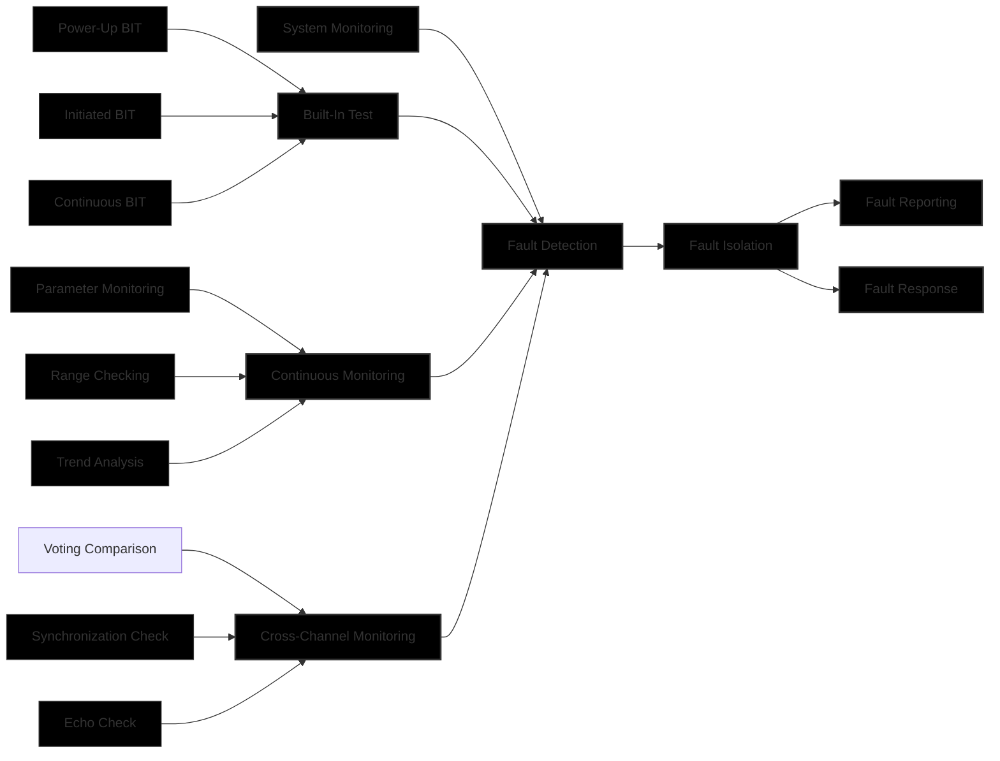
```mermaid
graph LR
    SM["System Monitoring"]:::mon --> FD["Fault Detection"]:::type
    BIT["Built-In Test"]:::mon --> FD
    CM["Continuous Monitoring"]:::type --> FD
    CrossMon["Cross-Channel Monitoring"]:::type --> FD
    PuBIT["Power-Up BIT"]:::check --> BIT
    InitBIT["Initiated BIT"]:::check --> BIT
    ContBIT["Continuous BIT"]:::check --> BIT
    ParamMon["Parameter Monitoring"]:::check --> CM
    RangeChk["Range Checking"]:::check --> CM
    TrendAnal["Trend Analysis"]:::check --> CM
    VoteComp["Voting Comparison"]:::vote --> CrossMon
    SyncChk["Synchronization Check"]:::check --> CrossMon
    EchoChk["Echo Check"]:::check --> CrossMon

    FD --> FI["Fault Isolation"]:::type
    FI --> FR["Fault Reporting"]:::action
    FI --> FResp["Fault Response"]:::action


    classDef mon fill:#f96,stroke:#333,stroke-width:2px,fill:#000;
    classDef type fill:#69f,stroke:#333,stroke-width:2px,fill:#000;
    classDef check fill:#9f6,stroke:#333,stroke-width:1px,fill:#000;
    classDef action fill:#f9f,stroke:#333,stroke-width:2px,fill:#000;
```

### C.8.2 Fault Response Architecture

The following diagram shows the fault response architecture in the A4001 Avionics System:

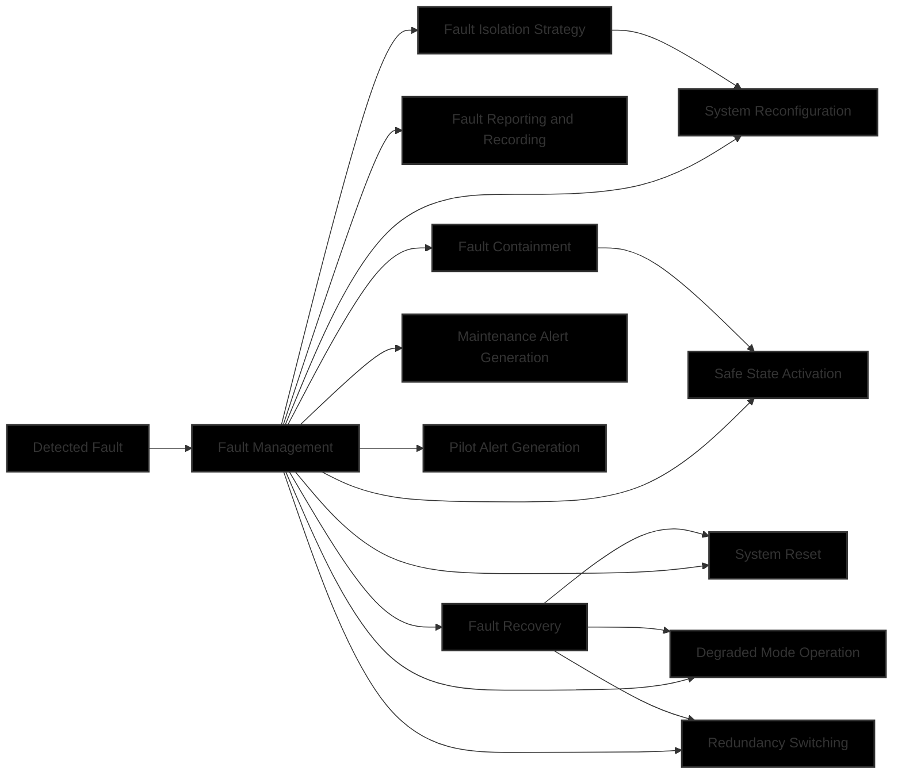
```mermaid
graph LR
    Fault["Detected Fault"]:::input --> FM["Fault Management"]:::proc
    FM --> FIS["Fault Isolation Strategy"]:::proc
    FM --> FRR["Fault Reporting and Recording"]:::proc
    FM --> FCT["Fault Containment"]:::proc
    FM --> FRec["Fault Recovery"]:::proc
    FM --> MaintAlert["Maintenance Alert Generation"]:::out
    FM --> PilotAlert["Pilot Alert Generation"]:::out

    FIS --> SystemConfig["System Reconfiguration"]:::action
    FCT --> SafeState["Safe State Activation"]:::action
    FRec --> Reset["System Reset"]:::action
    FRec --> DegradedMode["Degraded Mode Operation"]:::action
    FRec --> RedundancySwitch["Redundancy Switching"]:::action

    FM --> SystemConfig
    FM --> SafeState
    FM --> Reset
    FM --> DegradedMode
    FM --> RedundancySwitch


    classDef input fill:#f96,stroke:#333,stroke-width:2px,fill:#000;
    classDef proc fill:#69f,stroke:#333,stroke-width:2px,fill:#000;
    classDef out fill:#9f6,stroke:#333,stroke-width:2px,fill:#000;
    classDef action fill:#f9f,stroke:#333,stroke-width:2px,fill:#000;
```

## C.9 Security Architecture

The following diagram illustrates the security architecture of the A4001 Avionics System:

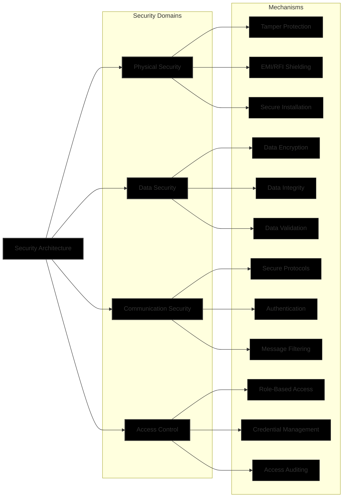
```mermaid
graph LR
    SecurityArch["Security Architecture"]:::main
    subgraph "Security Domains"
        PhySec["Physical Security"]:::domain
        DataSec["Data Security"]:::domain
        CommSec["Communication Security"]:::domain
        AccessCtrl["Access Control"]:::domain
    end
    subgraph "Mechanisms"
        TP["Tamper Protection"]:::mech
        Shield["EMI/RFI Shielding"]:::mech
        Install["Secure Installation"]:::mech
        Encrypt["Data Encryption"]:::mech
        Integrity["Data Integrity"]:::mech
        Validation["Data Validation"]:::mech
        Protocols["Secure Protocols"]:::mech
        Auth["Authentication"]:::mech
        MsgFilter["Message Filtering"]:::mech
        RBAC["Role-Based Access"]:::mech
        CredMan["Credential Management"]:::mech
        Audit["Access Auditing"]:::mech
    end

    SecurityArch --> PhySec
    SecurityArch --> DataSec
    SecurityArch --> CommSec
    SecurityArch --> AccessCtrl

    PhySec --> TP
    PhySec --> Shield
    PhySec --> Install

    DataSec --> Encrypt
    DataSec --> Integrity
    DataSec --> Validation

    CommSec --> Protocols
    CommSec --> Auth
    CommSec --> MsgFilter

    AccessCtrl --> RBAC
    AccessCtrl --> CredMan
    AccessCtrl --> Audit

    classDef main fill:#f96,stroke:#333,stroke-width:2px,fill:#000;
    classDef domain fill:#69f,stroke:#333,stroke-width:2px,fill:#000;
    classDef mech fill:#9f6,stroke:#333,stroke-width:1px,fill:#000;
```

## C.10 Certification Architecture

The following diagram shows the certification architecture of the A4001 Avionics System:

```mermaid
graph LR
    CertArch["Certification Architecture"]:::main
    subgraph "Certification Domains"
        SoftCert["Software (DO-178C)"]:::domain
        HwCert["Hardware (DO-254)"]:::domain
        EnvCert["Environmental (DO-160G)"]:::domain
        SysCert["System (ARP4754A)"]:::domain
    end
    subgraph "Aspects"
        SwLevel["Software Level A"]:::aspect
        SwProc["Software Processes"]:::aspect
        SwLife["Software Lifecycle"]:::aspect
        SwDoc["Software Documentation"]:::aspect

        HwLevel["Hardware Level A"]:::aspect
        HwProc["Hardware Processes"]:::aspect
        HwLife["Hardware Lifecycle"]:::aspect
        HwDoc["Hardware Documentation"]:::aspect

        EnvTest["Environmental Testing"]:::aspect
        EnvQual["Environmental Qualification"]:::aspect
        EnvDoc["Environmental Documentation"]:::aspect

        SysSafety["System Safety"]:::aspect
        SysReq["System Requirements"]:::aspect
        SysValid["System Validation"]:::aspect
        SysDoc["System Documentation"]:::aspect
    end

    CertArch --> SoftCert
    CertArch --> HwCert
    CertArch --> EnvCert
    CertArch --> SysCert

    SoftCert --> SwLevel
    SoftCert --> SwProc
    SoftCert --> SwLife
    SoftCert --> SwDoc

    HwCert --> HwLevel
    HwCert --> HwProc
    HwCert --> HwLife
    HwCert --> HwDoc

    EnvCert --> EnvTest
    EnvCert --> EnvQual
    EnvCert --> EnvDoc

    SysCert --> SysSafety
    SysCert --> SysReq
    SysCert --> SysValid
    SysCert --> SysDoc

    classDef main fill:#f96,stroke:#333,stroke-width:2px,fill:#000;
    classDef domain fill:#69f,stroke:#333,stroke-width:2px,fill:#000;
    classDef aspect fill:#9f6,stroke:#333,stroke-width:1px,fill:#000;
```

## C.11 System Architecture Evolution

The following diagram illustrates the planned evolution of the A4001 Avionics System architecture:

```mermaid
graph LR
    V1["Version 1.0\n(Basic Architecture)"]:::ver --> V2["Version 2.0\n(Enhanced Architecture)"]:::ver
    V2 --> V3["Version 3.0\n(Advanced Architecture)"]:::ver

    subgraph "Features"
        FC1["Flight Control"]:::feat
        Nav1["Basic Navigation"]:::feat
        Comm1["Basic Communication"]:::feat

        FC2["Enhanced Flight Control"]:::feat
        Nav2["Enhanced Navigation"]:::feat
        Comm2["Enhanced Communication"]:::feat
        DF1["Data Fusion"]:::feat

        FC3["Advanced Flight Control"]:::feat
        Nav3["Advanced Navigation"]:::feat
        Comm3["Advanced Communication"]:::feat
        DF2["Advanced Data Fusion"]:::feat
        Auto["Autonomous Functions"]:::feat
    end

    V1 --> FC1
    V1 --> Nav1
    V1 --> Comm1

    V2 --> FC2
    V2 --> Nav2
    V2 --> Comm2
    V2 --> DF1

    V3 --> FC3
    V3 --> Nav3
    V3 --> Comm3
    V3 --> DF2
    V3 --> Auto

    classDef ver fill:#f96,stroke:#333,stroke-width:2px,fill:#000;
    classDef feat fill:#69f,stroke:#333,stroke-width:1px,fill:#000;
```

## C.12 System Architecture Summary

The A4001 Avionics System architecture is designed to meet the functional, performance, safety, reliability, and certification requirements specified in this document. The architecture provides:

1.  **Redundancy**: Triple redundancy for flight control functions and dual redundancy for navigation and communication functions to meet safety and reliability requirements.
2.  **Modularity**: A modular design that separates functions into distinct subsystems and components to facilitate development, testing, and maintenance.
3.  **Fault Tolerance**: Comprehensive fault detection, isolation, and recovery capabilities to ensure continued safe operation in the presence of failures.
4.  **Certification Compliance**: An architecture designed to comply with relevant certification standards, including DO-178C, DO-254, DO-160G, and ARP4754A.
5.  **Scalability**: An architecture that can evolve to accommodate future enhancements and additional functionality.

The architecture diagrams provided in this appendix serve as a reference for system development, integration, verification, and certification activities.

### Appendix D: Interface Diagrams

## D.1 Purpose

This appendix provides detailed interface diagrams for the A4001 Avionics System. These diagrams illustrate the external and internal interfaces of the system, including physical connections, data flows, protocols, and signal characteristics. The interface diagrams serve as a reference for system integration, verification, and maintenance activities.

## D.2 External Interface Overview

The following diagram provides a high-level overview of the external interfaces between the A4001 Avionics System and other aircraft systems:

```mermaid
graph LR
    A["A4001 Avionics System"]:::main
    subgraph External Systems
        B["Flight Control Actuators"]:::control
        C["Engine Control System"]:::control
        D["Landing Gear System"]:::control
        E["Primary Flight Display"]:::display
        F["Multi-Function Display"]:::display
        G["Engine Indication and\nCrew Alerting System"]:::display
        H["Power System"]:::support
        I["Aircraft Sensors"]:::support
        J["Pilot Controls"]:::support
        K["Maintenance Computer"]:::support
        L["External Antennas"]:::support
    end

    B <--> A
    C <--> A
    D <--> A
    E <--> A
    F <--> A
    G <--> A
    H <--> A
    I --> A
    J --> A
    K <--> A
    L <--> A

    classDef main fill:#f96,stroke:#333,stroke-width:4px,fill:#000;
    classDef control fill:#69f,stroke:#333,stroke-width:2px,fill:#000;
    classDef display fill:#9f6,stroke:#333,stroke-width:2px,fill:#000;
    classDef support fill:#f9f,stroke:#333,stroke-width:2px,fill:#000;
```

## D.3 External Interface Details

### D.3.1 Flight Control Actuator Interface

The following diagram shows the interface between the A4001 Avionics System and the Flight Control Actuators:

```mermaid
graph LR
    A[A4001 Avionics System]:::main
    subgraph Command Signals
        CS[Command Signals]:::signal
        PC[Power Control]:::signal
        MC[Mode Control]:::signal
    end
    subgraph Actuators
        Elev[Elevator Actuators]:::act
        Ail[Aileron Actuators]:::act
        Rud[Rudder Actuators]:::act
        Flap[Flap Actuators]:::act
        Spoiler[Spoiler Actuators]:::act
    end
    subgraph Feedback
        PF[Position Feedback]:::fb
    end

    A --> CS
    A --> PC
    A --> MC

    CS --> Elev
    CS --> Ail
    CS --> Rud
    CS --> Flap
    CS --> Spoiler

    Elev --> PF
    Ail --> PF
    Rud --> PF
    Flap --> PF
    Spoiler --> PF

    PF --> A

    classDef main fill:#f96,stroke:#333,stroke-width:2px,fill:#000;
    classDef signal fill:#69f,stroke:#333,stroke-width:2px,fill:#000;
    classDef act fill:#9f6,stroke:#333,stroke-width:2px,fill:#000;
    classDef fb fill:#f9f,stroke:#333,stroke-width:2px,fill:#000;
```

### D.3.2 Display System Interface

The following diagram shows the interface between the A4001 Avionics System and the Display Systems:

```mermaid
graph LR
    A[A4001 Avionics System]:::main
    subgraph Data
        ND[Navigation Data]:::data
        FD[Flight Data]:::data
        AD[Alert Data]:::data
        SS[System Status]:::data
    end
    subgraph Displays
        PFD[Primary Flight Display]:::disp
        MFD[Multi-Function Display]:::disp
        EICAS[Engine Indication and<br>Crew Alerting System]:::disp
    end
    subgraph Feedback
        CI[Control Inputs]:::fb
    end

    A --> ND
    A --> FD
    A --> AD
    A --> SS

    ND --> PFD
    ND --> MFD
    ND --> EICAS

    FD --> PFD
    FD --> MFD
    FD --> EICAS

    AD --> PFD
    AD --> MFD
    AD --> EICAS

    SS --> PFD
    SS --> MFD
    SS --> EICAS

    CI --> A

    classDef main fill:#f96,stroke:#333,stroke-width:2px,fill:#000;
    classDef data fill:#69f,stroke:#333,stroke-width:2px,fill:#000;
    classDef disp fill:#9f6,stroke:#333,stroke-width:2px,fill:#000;
    classDef fb fill:#f9f,stroke:#333,stroke-width:2px,fill:#000;
```

### D.3.3 Sensor Interface

The following diagram shows the interface between the A4001 Avionics System and the Aircraft Sensors:

```mermaid
graph LR
    I[Aircraft Sensors]:::main
    subgraph Sensor Categories
        AD[Air Data Sensors]:::cat
        Att[Attitude Sensors]:::cat
        Pos[Position Sensors]:::cat
        Eng[Engine Sensors]:::cat
        Sys[System Sensors]:::cat
    end
    subgraph Specific Sensors
        PT[Pitot Tubes]:::sens
        SP[Static Ports]:::sens
        TAT[Total Air Temperature]:::sens
        AOA[Angle of Attack]:::sens
        Gyro[Gyroscopes]:::sens
        Accel[Accelerometers]:::sens
        Mag[Magnetometers]:::sens
        GPS[GPS Receivers]:::sens
        DME[Distance Measuring Equipment]:::sens
        VOR[VHF Omnidirectional Range]:::sens
        ILS[Instrument Landing System]:::sens
        N1[N1 Speed]:::sens
        N2[N2 Speed]:::sens
        EGT[Exhaust Gas Temperature]:::sens
        FF[Fuel Flow]:::sens
        HP[Hydraulic Pressure]:::sens
        EP[Electrical Parameters]:::sens
        FQ[Fuel Quantity]:::sens
        LGP[Landing Gear Position]:::sens
    end
    A[A4001 Avionics System]

    I --> AD
    I --> Att
    I --> Pos
    I --> Eng
    I --> Sys

    AD --> PT
    AD --> SP
    AD --> TAT
    AD --> AOA

    Att --> Gyro
    Att --> Accel
    Att --> Mag

    Pos --> GPS
    Pos --> DME
    Pos --> VOR
    Pos --> ILS

    Eng --> N1
    Eng --> N2
    Eng --> EGT
    Eng --> FF

    Sys --> HP
    Sys --> EP
    Sys --> FQ
    Sys --> LGP

    AD --> A
    Att --> A
    Pos --> A
    Eng --> A
    Sys --> A


    classDef main fill:#f96,stroke:#333,stroke-width:2px,fill:#000;
    classDef cat fill:#69f,stroke:#333,stroke-width:2px,fill:#000;
    classDef sens fill:#9f6,stroke:#333,stroke-width:1px,fill:#000;
```

### D.3.4 Control Interface

The following diagram shows the interface between the A4001 Avionics System and the Pilot Controls:

```mermaid
graph LR
    PC[Pilot Controls]:::main
    subgraph Control Categories
        PFC[Primary Flight Controls]:::cat
        SFC[Secondary Flight Controls]:::cat
        AP[Autopilot Controls]:::cat
        Nav[Navigation Controls]:::cat
        Comm[Communication Controls]:::cat
    end
    subgraph Specific Controls
        Stick[Control Stick/Yoke]:::ctrl
        Pedals[Rudder Pedals]:::ctrl
        Throttle[Throttle Levers]:::ctrl
        Flap[Flap Lever]:::ctrl
        Spoiler[Spoiler Lever]:::ctrl
        Trim[Trim Controls]:::ctrl
        Mode[Mode Selector]:::ctrl
        Alt[Altitude Selector]:::ctrl
        Speed[Speed Selector]:::ctrl
        Head[Heading Selector]:::ctrl
        Freq[Frequency Selector]:::ctrl
        Course[Course Selector]:::ctrl
        Wpt[Waypoint Selector]:::ctrl
        RadioSel[Radio Selector]:::ctrl
        Volume[Volume Control]:::ctrl
        PTT[Push-to-Talk]:::ctrl
    end
    A[A4001 Avionics System]

    PC --> PFC
    PC --> SFC
    PC --> AP
    PC --> Nav
    PC --> Comm

    PFC --> Stick
    PFC --> Pedals
    PFC --> Throttle

    SFC --> Flap
    SFC --> Spoiler
    SFC --> Trim

    AP --> Mode
    AP --> Alt
    AP --> Speed
    AP --> Head

    Nav --> Freq
    Nav --> Course
    Nav --> Wpt

    Comm --> RadioSel
    Comm --> Volume
    Comm --> PTT

    PFC --> A
    SFC --> A
    AP --> A
    Nav --> A
    Comm --> A

    classDef main fill:#f96,stroke:#333,stroke-width:2px,fill:#000;
    classDef cat fill:#69f,stroke:#333,stroke-width:2px,fill:#000;
    classDef ctrl fill:#9f6,stroke:#333,stroke-width:1px,fill:#000;
```

### D.3.5 Power System Interface

The following diagram shows the interface between the A4001 Avionics System and the Aircraft Power System:

```mermaid
graph LR
    APS[Aircraft Power System]:::main
    subgraph Power Categories
        PP[Primary Power]:::cat
        SP[Secondary Power]:::cat
        EP[Emergency Power]:::cat
    end
    subgraph Specific Power Sources
        V115[115V AC 400Hz]:::pwr
        V28[28V DC]:::pwr
        Batt[Battery Power]:::pwr
        RAT[Ram Air Turbine]:::pwr
    end
    A[A4001 Avionics System]
    subgraph Feedback
        PM[Power Monitoring]:::fb
    end

    APS --> PP
    APS --> SP
    APS --> EP

    PP --> V115
    SP --> V28
    EP --> Batt
    EP --> RAT

    PP --> A
    SP --> A
    EP --> A

    A --> PM

    classDef main fill:#f96,stroke:#333,stroke-width:2px,fill:#000;
    classDef cat fill:#69f,stroke:#333,stroke-width:2px,fill:#000;
    classDef pwr fill:#9f6,stroke:#333,stroke-width:1px,fill:#000;
    classDef fb fill:#f9f,stroke:#333,stroke-width:2px,fill:#000;
```

## D.4 Internal Interface Overview

The following diagram provides a high-level overview of the internal interfaces between the major subsystems of the A4001 Avionics System:

```mermaid
graph LR
    A["A4001 Avionics System"]:::main
    subgraph Subsystems
        FCS["A4001-A\nFlight Control System"]:::sub
        Nav["A4001-B\nNavigation System"]:::sub
        Comm["A4001-C\nCommunication System"]:::sub
    end
    subgraph SupportSystems["Support Systems"]
        SMU["System Management Unit"]:::sup
        PSU["Power Supply Unit"]:::sup
    end

    A --> FCS
    A --> Nav
    A --> Comm
    A --> SMU
    A --> PSU

    FCS <--> Nav
    FCS <--> Comm
    Nav <--> Comm

    FCS <--> SMU
    Nav <--> SMU
    Comm <--> SMU

    FCS --> PSU
    Nav --> PSU
    Comm --> PSU
    SMU --> PSU

    classDef main fill:#f96,stroke:#333,stroke-width:2px,fill:#000;
    classDef sub fill:#69f,stroke:#333,stroke-width:2px,fill:#000;
    classDef sup fill:#9f6,stroke:#333,stroke-width:2px,fill:#000;
```

## D.5 Internal Interface Details

### D.5.1 Flight Control System to Navigation System Interface

The following diagram shows the interface between the Flight Control System and the Navigation System:

```mermaid
graph LR
    FCS["A4001-A \n Flight Control System"]:::sys
    Nav["A4001-B \n Navigation System"]:::sys
    subgraph "Data Requested"
        PosReq["Position Request"]:::req
        AttReq["Attitude Request"]:::req
        VelReq["Velocity Request"]:::req
        FPReq["Flight Path Request"]:::req
    end
    subgraph "Data Provided"
        PosData["Position Data"]:::data
        AttData["Attitude Data"]:::data
        VelData["Velocity Data"]:::data
        FPData["Flight Path Data"]:::data
        NavInt["Navigation Integrity"]:::data
    end

    FCS --> PosReq
    FCS --> AttReq
    FCS --> VelReq
    FCS --> FPReq

    PosReq --> Nav
    AttReq --> Nav
    VelReq --> Nav
    FPReq --> Nav

    Nav --> PosData
    Nav --> AttData
    Nav --> VelData
    Nav --> FPData
    Nav --> NavInt

    PosData --> FCS
    AttData --> FCS
    VelData --> FCS
    FPData --> FCS
    NavInt --> FCS

    classDef sys fill:#f96,stroke:#333,stroke-width:2px,fill:#000;
    classDef req fill:#69f,stroke:#333,stroke-width:1px,fill:#000;
    classDef data fill:#9f6,stroke:#333,stroke-width:1px,fill:#000;
```

### D.5.2 Flight Control System to Communication System Interface

The following diagram shows the interface between the Flight Control System and the Communication System:

```mermaid
graph LR
    FCS["A4001-A \n Flight Control System"]:::sys
    Comm["A4001-C \n Communication<br>System"]:::sys
    subgraph Status
        FCSStatus[FCS Status]:::status
        FMode[Flight Mode]:::status
        AlertStatus[Alert Status]:::status
    end
    subgraph Commands
        ModeCmds[Mode Change Commands]:::cmd
        ParamCmds[Parameter Update Commands]:::cmd
    end
    subgraph Data
        DLInfo[Datalink Information]:::cmd
    end

    FCS --> FCSStatus
    FCS --> FMode
    FCS --> AlertStatus
    FCS --> ModeCmds
    FCS --> ParamCmds

    FCSStatus --> Comm
    FMode --> Comm
    AlertStatus --> Comm
    ModeCmds --> Comm
    ParamCmds --> Comm

    Comm --> DLInfo
    DLInfo --> FCS

    classDef sys fill:#f96,stroke:#333,stroke-width:2px,fill:#000;
    classDef status fill:#69f,stroke:#333,stroke-width:1px,fill:#000;
    classDef cmd fill:#9f6,stroke:#333,stroke-width:1px,fill:#000;
```

### D.5.3 Navigation System to Communication System Interface

The following diagram shows the interface between the Navigation System and the Communication System:

```mermaid
graph LR
    Nav["A4001-B \n Navigation System"]:::sys
    Comm["A4001-C \n Communication<br>System"]:::sys
    subgraph NavData
        PosData[Position Data]:::nav
        RouteData[Route Data]:::nav
        NavStatus[Navigation Status]:::nav
        IntegrityStatus[Integrity Status]:::nav
    end
    subgraph CommData
        FreqData[Frequency Data]:::com
        DatalinkMsgs[Datalink Messages]:::com
        DBUpdates[Database Updates]:::com
    end

    Nav --> PosData
    Nav --> RouteData
    Nav --> NavStatus
    Nav --> IntegrityStatus

    PosData --> Comm
    RouteData --> Comm
    NavStatus --> Comm
    IntegrityStatus --> Comm

    Comm --> FreqData
    Comm --> DatalinkMsgs
    Comm --> DBUpdates

    FreqData --> Nav
    DatalinkMsgs --> Nav
    DBUpdates --> Nav

    classDef sys fill:#f96,stroke:#333,stroke-width:2px,fill:#000;
    classDef nav fill:#69f,stroke:#333,stroke-width:1px,fill:#000;
    classDef com fill:#9f6,stroke:#333,stroke-width:1px,fill:#000;
```

### D.5.4 System Management Unit Interface

The following diagram shows the interface between the System Management Unit and the other subsystems:

```mermaid
graph LR
    SMU["System Management Unit"]:::main
    subgraph Monitoring
        FCSMon[FCS Monitoring]:::mon
        NavMon[Navigation Monitoring]:::mon
        CommMon[Communication Monitoring]:::mon
        PowerMon[Power Monitoring]:::mon
    end
    subgraph Subsystems
        FCS["A4001-A \n Flight Control System"]:::sys
        Nav["A4001-B \n Navigation System"]:::sys
        Comm["A4001-C \n Communication<br>System"]:::sys
        PSU["Power Supply Unit"]:::sys
    end
    subgraph Status
        FCSStatus[FCS Status]:::status
        NavStatus[Navigation Status]:::status
        CommStatus[Communication Status]:::status
        PowerStatus[Power Status]:::status
    end
    subgraph Interfaces
        MaintInt[Maintenance Interface]:::out
        DiagInt[Diagnostic Interface]:::out
        SysLog[System Log]:::out
    end

    SMU --> Monitoring
    Monitoring --> FCSMon
    Monitoring --> NavMon
    Monitoring --> CommMon
    Monitoring --> PowerMon

    FCS --> FCSStatus
    Nav --> NavStatus
    Comm --> CommStatus
    PSU --> PowerStatus

    FCSStatus --> SMU
    NavStatus --> SMU
    CommStatus --> SMU
    PowerStatus --> SMU

    SMU --> MaintInt
    SMU --> DiagInt
    SMU --> SysLog

    classDef main fill:#f96,stroke:#333,stroke-width:2px,fill:#000;
    classDef mon fill:#69f,stroke:#333,stroke-width:1px,fill:#000;
    classDef sys fill:#9f6,stroke:#333,stroke-width:2px,fill:#000;
    classDef status fill:#f69,stroke:#333,stroke-width:1px,fill:#000;
    classDef out fill:#6f9,stroke:#333,stroke-width:2px,fill:#000;
```

## D.6 Interface Protocol Details

### D.6.1 ARINC 429 Interface

The following diagram shows the ARINC 429 interface used in the A4001 Avionics System:

```mermaid
graph LR
    TX["Transmitter"]:::comp --> Word["32-bit Word"]:::word
    Word --> Label["Label (8 bits)"]:::field
    Word --> SDI["SDI (2 bits)"]:::field
    Word --> Data["Data (19 bits)"]:::field
    Word --> SSM["SSM (2 bits)"]:::field
    Word --> Parity["Parity (1 bit)"]:::field
    Word --> RX["Receiver"]:::comp

    classDef comp fill:#f96,stroke:#333,stroke-width:2px,fill:#000;
    classDef word fill:#69f,stroke:#333,stroke-width:2px,fill:#000;
    classDef field fill:#9f6,stroke:#333,stroke-width:1px,fill:#000;
```

### D.6.2 AFDX Interface

The following diagram shows the AFDX (Avionics Full-Duplex Switched Ethernet) interface used in the A4001 Avionics System:

```mermaid
graph LR
    ES1["End System 1"]:::es --> Switch1["AFDX Switch 1"]:::sw
    ES2["End System 2"]:::es --> Switch1
    ES3["End System 3"]:::es --> Switch1
    Switch1 --> VL1["Virtual Link 1"]:::vl
    Switch1 --> VL2["Virtual Link 2"]:::vl
    Switch1 --> VL3["Virtual Link 3"]:::vl
    Switch1 --> Switch2["AFDX Switch 2"]:::sw
    VL1 --> ES2
    VL2 --> ES3
    VL3 --> ES1
    Switch2 --> VL4["Virtual Link 4"]:::vl
    Switch2 --> VL5["Virtual Link 5"]:::vl
    VL4 --> ES1
    VL5 --> ES3


    classDef es fill:#f96,stroke:#333,stroke-width:2px,fill:#000;
    classDef sw fill:#69f,stroke:#333,stroke-width:2px,fill:#000;
    classDef vl fill:#9f6,stroke:#333,stroke-width:1px,fill:#000;
```

### D.6.3 CAN Bus Interface

The following diagram shows the CAN Bus interface used in the A4001 Avionics System:

```mermaid
graph LR
    Bus["CAN Bus"]:::bus
    Node1["Node 1"]:::node --> Bus
    Node2["Node 2"]:::node --> Bus
    Node3["Node 3"]:::node --> Bus
    Node4["Node 4"]:::node --> Bus
    Bus --> Frame["CAN Frame"]:::frame
    Frame --> SOF["Start of Frame"]:::field
    Frame --> ID["Identifier"]:::field
    Frame --> Ctrl["Control"]:::field
    Frame --> Data["Data (0-8 bytes)"]:::field
    Frame --> CRC["CRC"]:::field
    Frame --> ACK["ACK"]:::field
    Frame --> EOF["End of Frame"]:::field

    classDef bus fill:#f96,stroke:#333,stroke-width:4px,fill:#000;
    classDef node fill:#69f,stroke:#333,stroke-width:2px,fill:#000;
    classDef frame fill:#9f6,stroke:#333,stroke-width:2px,fill:#000;
    classDef field fill:#f9f,stroke:#333,stroke-width:1px,fill:#000;
```

## D.7 Physical Interface Details

### D.7.1 Connector Types

The following diagram shows the connector types used in the A4001 Avionics System:

```mermaid
graph LR
    A["A4001 Avionics System"]:::main
    subgraph "Connector Types"
        Pwr["Power Connectors"]:::type
        Data["Data Connectors"]:::type
        RF["RF Connectors"]:::type
        Maint["Maintenance Connectors"]:::type
    end
    subgraph "Specific Connectors"
        MS3456["MS3456 - Primary Power"]:::conn
        MS3459["MS3459 - Secondary Power"]:::conn
        ARINC600["ARINC 600 - Main Data"]:::conn
        DSub["D-Sub - Discrete Signals"]:::conn
        Fiber["Fiber Optic - High Speed Data"]:::conn
        TNC["TNC - VHF/UHF"]:::conn
        SMA["SMA - GPS"]:::conn
        NType["N-Type - SATCOM"]:::conn
        RJ45["Ethernet RJ45"]:::conn
        USB["USB Type A"]:::conn
        Custom["Custom Test Port"]:::conn
    end

    A --> Pwr
    A --> Data
    A --> RF
    A --> Maint

    Pwr --> MS3456
    Pwr --> MS3459
    Data --> ARINC600
    Data --> DSub
    Data --> Fiber
    RF --> TNC
    RF --> SMA
    RF --> NType
    Data --> RJ45
    Maint --> USB
    Maint --> Custom

    classDef main fill:#f96,stroke:#333,stroke-width:2px,fill:#000;
    classDef type fill:#69f,stroke:#333,stroke-width:2px,fill:#000;
    classDef conn fill:#9f6,stroke:#333,stroke-width:1px,fill:#000;
```

### D.7.2 LRU Mounting Interface

The following diagram shows the Line Replaceable Unit (LRU) mounting interface for the A4001 Avionics System:

```mermaid
graph LR
    LRU["A4001 LRU"]:::lru
    subgraph "Mounting Points"
        Front["Front Mounting Flange"]:::type
        Side["Side Rails"]:::type
        Rear["Rear Support"]:::type
    end
    subgraph "Cooling Interface"
        Intake["Forced Air Intake"]:::feat
        Exhaust["Exhaust Vents"]:::feat
        Plate["Conduction Cooling Plate"]:::feat
    end
    subgraph "Connector Interface"
        PowerConn["Power Connector"]:::feat
        DataConn["Data Connectors"]:::feat
        RFConn["RF Connectors"]:::feat
        MaintPort["Maintenance Port"]:::feat
    end
    subgraph "Handling Interface"
        Handles["Handles"]:::type
        FrontHandles["Front Handles"]:::feat
    end
    subgraph "Locking Mechanism"
        Lock["Locking Mechanism"]:::feat
    end

    LRU --> MountingPoints
    LRU --> CoolingInterface
    LRU --> ConnectorInterface
    LRU --> HandlingInterface
    LRU --> LockingMechanism

    MountingPoints --> Front
    MountingPoints --> Side
    MountingPoints --> Rear

    CoolingInterface --> Intake
    CoolingInterface --> Exhaust
    CoolingInterface --> Plate

    ConnectorInterface --> PowerConn
    ConnectorInterface --> DataConn
    ConnectorInterface --> RFConn
    ConnectorInterface --> MaintPort

    HandlingInterface --> Handles
    Handles --> FrontHandles

    LockingMechanism --> Lock

    classDef lru fill:#f96,stroke:#333,stroke-width:2px,fill:#000;
    classDef type fill:#69f,stroke:#333,stroke-width:2px,fill:#000;
    classDef feat fill:#9f6,stroke:#333,stroke-width:1px,fill:#000;
```

## D.8 Software Interface Details

### D.8.1 API Structure

The following diagram shows the API structure for the A4001 Avionics System software:

```mermaid
graph TD
    Main["A4001 Software API"]:::main
    subgraph Core
        Init["System Initialization"]:::func
        Mem["Memory Management"]:::func
        Sched["Task Scheduling"]:::func
        IPC["Inter-Process Communication"]:::func
        Err["Error Handling"]:::func
    end
    subgraph SubsystemAPIs["Subsystem APIs"]
        FCAPI["Flight Control API"]:::api
        NavAPI["Navigation API"]:::api
        CommAPI["Communication API"]:::api
        DiagAPI["Diagnostic API"]:::api
        SysManAPI["System Management API"]:::api
    end
    subgraph FunctionGroups["Function Groups"]
        CLInt["Control Law Interface"]:::func
        ModeMan["Mode Management"]:::func
        Actrl["Actuator Control"]:::func

        SensorProc["Sensor Processing"]:::func
        PosCalc["Position Calculation"]:::func
        RouteMan["Route Management"]:::func
        SensorFusion["Sensor Fusion"]:::func
        DBAccess["Database Access"]:::func

        RadioCtrl["Radio Control"]:::func
        MsgFormat["Message Formatting"]:::func
        ProtHandling["Protocol Handling"]:::func
        AudioMan["Audio Management"]:::func

        BIT["Built-In Test"]:::func
        FaultLog["Fault Logging"]:::func
        PerfMon["Performance Monitoring"]:::func

        MaintInt["Maintenance Interface"]:::func
    end

    Main --> Core
    Main --> SubsystemAPIs
    SubsystemAPIs --> FunctionGroups

    FCAPI --> CLInt
    FCAPI --> ModeMan
    FCAPI --> Actrl

    NavAPI --> SensorProc
    NavAPI --> PosCalc
    NavAPI --> RouteMan
    NavAPI --> SensorFusion
    NavAPI --> DBAccess

    CommAPI --> RadioCtrl
    CommAPI --> MsgFormat
    CommAPI --> ProtHandling
    CommAPI --> AudioMan

    DiagAPI --> BIT
    DiagAPI --> FaultLog
    DiagAPI --> PerfMon

    SysManAPI --> MaintInt
    SysManAPI --> BIT
    SysManAPI --> FaultLog
    SysManAPI --> PerfMon

    classDef main fill:#f96,stroke:#333,stroke-width:2px,fill:#000;
    classDef api fill:#69f,stroke:#333,stroke-width:2px,fill:#000;
    classDef func fill:#9f6,stroke:#333,stroke-width:1px,fill:#000;
```

### D.8.2 Data Exchange Format

The following diagram shows the data exchange format used in the A4001 Avionics System software:

```mermaid
graph LR
    Msg["Message Structure"]:::msg
    Msg --> Header["Header"]:::part
    Msg --> Body["Body"]:::part
    Msg --> Trailer["Trailer"]:::part

    Header --> MID["Message ID (4 bytes)"]:::field
    Header --> SID["Source ID (2 bytes)"]:::field
    Header --> DID["Destination ID (2 bytes)"]:::field
    Header --> ML["Message Length (2 bytes)"]:::field
    Header --> SN["Sequence Number (2 bytes)"]:::field
    Header --> TS["Timestamp (8 bytes)"]:::field
    Header --> MT["Message Type (2 bytes)"]:::field

    Body --> Data["Data Fields (Variable)"]:::field

    Trailer --> CS["Checksum (4 bytes)"]:::field
    Trailer --> EM["End Marker (2 bytes)"]:::field

    classDef msg fill:#f96,stroke:#333,stroke-width:2px,fill:#000;
    classDef part fill:#69f,stroke:#333,stroke-width:2px,fill:#000;
    classDef field fill:#9f6,stroke:#333,stroke-width:1px,fill:#000;
```

### D.8.3 Inter-Process Communication

The following diagram shows the inter-process communication mechanism used in the A4001 Avionics System software:

```mermaid
graph LR
    IPC["Inter-Process Communication"]:::main
    subgraph Mechanisms
        MQ["Message Queues"]:::mech
        SM["Shared Memory"]:::mech
        Sem["Semaphores"]:::mech
        Sig["Signals"]:::mech
    end
    subgraph Processes
        P1["Process 1"]:::proc
        P2["Process 2"]:::proc
        P3["Process 3"]:::proc
    end

    IPC --> Mechanisms
    IPC --> Processes

    Processes --> MQ
    Processes --> SM
    Processes --> Sem
    Processes --> Sig

    classDef main fill:#f96,stroke:#333,stroke-width:2px,fill:#000;
    classDef mech fill:#69f,stroke:#333,stroke-width:2px,fill:#000;
    classDef proc fill:#9f6,stroke:#333,stroke-width:1px,fill:#000;
```

## D.9 Data Flow Diagrams

### D.9.1 Flight Control System Data Flow

The following diagram shows the data flow within the Flight Control System:

```mermaid
graph LR
    SensorInputs["Sensor Inputs"]:::input --> DataAcquisition["Data Acquisition"]:::proc
    ControlInputs["Control Inputs"]:::input --> SignalProcessing["Signal Processing"]:::proc
    DataAcquisition --> SignalProcessing
    SignalProcessing --> ControlLaws["Control Laws"]:::proc
    ControlLaws --> EnvelopeProtection["Envelope Protection"]:::proc
    EnvelopeProtection --> CommandGeneration["Command Generation"]:::proc
    CommandGeneration --> CommandMonitoring["Command Monitoring"]:::proc
    CommandMonitoring --> OutputProcessing["Output Processing"]:::proc
    OutputProcessing --> ActuatorCommands["Actuator Commands"]:::out

    classDef input fill:#f96,stroke:#333,stroke-width:2px,fill:#000;
    classDef proc fill:#69f,stroke:#333,stroke-width:2px,fill:#000;
    classDef out fill:#9f6,stroke:#333,stroke-width:2px,fill:#000;
```

### D.9.2 Navigation System Data Flow

The following diagram shows the data flow within the Navigation System:

```mermaid
graph LR
    GPSData["GPS Data"]:::input --> SensorIntegration["Sensor Integration"]:::proc
    InertialData["Inertial Data"]:::input --> SensorIntegration
    RadioNavData["Radio Nav Data"]:::input --> SensorIntegration
    SensorIntegration --> DataFiltering["Data Filtering"]:::proc
    DataFiltering --> DataFusion["Data Fusion"]:::proc
    DataFusion --> PositionDetermination["Position Determination"]:::proc
    NavigationDatabase["Navigation Database"]:::proc --> RouteProcessing["Route Processing"]:::proc
    RouteProcessing --> PositionDetermination
    PositionDetermination --> IntegrityMonitoring["Integrity Monitoring"]:::proc
    IntegrityMonitoring --> OutputProcessing["Output Processing"]:::proc
    OutputProcessing --> DisplayData["Display Data"]:::out
    OutputProcessing --> FlightControlData["Flight Control Data"]:::out

    classDef input fill:#f96,stroke:#333,stroke-width:2px,fill:#000;
    classDef proc fill:#69f,stroke:#333,stroke-width:2px,fill:#000;
    classDef out fill:#9f6,stroke:#333,stroke-width:2px,fill:#000;
```

### D.9.3 Communication System Data Flow

The following diagram shows the data flow within the Communication System:

```mermaid
graph LR
    AudioInputs["Audio Inputs"]:::input --> AudioProcessing["Audio Processing"]:::proc
    DataInputs["Data Inputs"]:::input --> DataFormatting["Data Formatting"]:::proc
    AudioProcessing --> AudioMixing["Audio Mixing"]:::proc
    DataFormatting --> AudioMixing
    AudioMixing --> AudioOutputProcessing["Audio Output Processing"]:::proc
    DataFormatting --> ProtocolProcessing["Protocol Processing"]:::proc
    ProtocolProcessing --> DataOutputProcessing["Data Output Processing"]:::proc
    AudioOutputProcessing --> SpeakerOutput["Speaker Output"]:::out
    DataOutputProcessing --> RadioTransmission["Radio Transmission"]:::out
    RadioReception["Radio Reception"]:::input --> DataOutputProcessing
    DataOutputProcessing --> AudioDecoding["Audio Decoding"]:::proc
    DataOutputProcessing --> DataDecoding["Data Decoding"]:::proc
    AudioDecoding --> AudioProcessing
    DataDecoding --> DataFormatting
    DataOutputProcessing --> DisplayData["Display Data"]:::out

    classDef input fill:#f96,stroke:#333,stroke-width:2px,fill:#000;
    classDef proc fill:#69f,stroke:#333,stroke-width:2px,fill:#000;
    classDef out fill:#9f6,stroke:#333,stroke-width:2px,fill:#000;
```

## D.10 Interface Verification

### D.10.1 Interface Verification Process

The following diagram shows the interface verification process for the A4001 Avionics System:

```mermaid
graph LR
    Spec["1. INTERFACE<br>SPECIFICATION"] --> UnitVer["2. UNIT-LEVEL<br>VERIFICATION"]
    UnitVer --> IntTest["3. INTEGRATION<br>TESTING"]
    IntTest --> SysVer["4. SYSTEM<br>VERIFICATION"]
    SysVer --> CertDoc["5. CERTIFICATION<br>DOCUMENTATION"]

    subgraph "Inputs/Outputs"
        SpecIO["- ICD Documents<br>- Interface Matrix<br>- Protocol Definitions"]
        UnitVerIO["- Signal Integrity<br>- Timing<br>- Electrical Compliance"]
        IntTestIO["- Interface Protocol Compliance<br>- Data Exchange<br>- Fault Injection"]
        SysVerIO["- Aircraft Level Tests<br>- End-to-End Verification<br>- Environmental Testing"]
        CertDocIO["- Test Reports<br>- Compliance Matrix<br>- Declaration of Conformity"]
    end

    Spec --> SpecIO
    UnitVer --> UnitVerIO
    IntTest --> IntTestIO
    SysVer --> SysVerIO
    CertDoc --> CertDocIO

    classDef default fill:#eee,stroke:#999,stroke-width:1px,fill:#000;
    classDef process fill:#69f,stroke:#333,stroke-width:2px,fill:#000;
    classDef documentation fill:#f96,stroke:#333,stroke-width:2px,fill:#000;
    classDef io fill:#f9f,stroke:#333,stroke-width:1px,fill:#000;

    Spec:::documentation
    UnitVer:::process
    IntTest:::process
    SysVer:::process
    CertDoc:::documentation

    SpecIO:::io
    UnitVerIO:::io
    IntTestIO:::io
    SysVerIO:::io
    CertDocIO:::io
```

### D.10.2 Interface Test Configuration

The following diagram shows the interface test configuration for the A4001 Avionics System:

```mermaid
graph LR
    TE["Test Environment"]:::env
    subgraph "Test Setup"
        UUT["A4001 System Under Test"]:::uut
        Sim["Interface Simulators"]:::sim
        Meas["Measurement Equipment"]:::meas
        Ctrl["Test Control System"]:::ctrl
    end
    subgraph "Simulated Interfaces"
        ActSim["Flight Control Actuator Simulator"]:::iface
        SensSim["Sensor Simulator"]:::iface
        DispSim["Display Simulator"]:::iface
        PwrSim["Power System Simulator"]:::iface
    end
    subgraph "Analysis Tools"
        SigAnal["Signal Analyzer"]:::tool
        ProtAnal["Protocol Analyzer"]:::tool
        PwrAnal["Power Analyzer"]:::tool
        TestSeq["Test Sequence Control"]:::tool
        DataRec["Data Recording"]:::tool
        ResAnal["Result Analysis"]:::tool
    end

    TE --> UUT
    TE --> Sim
    TE --> Meas
    TE --> Ctrl

    Sim --> ActSim
    Sim --> SensSim
    Sim --> DispSim
    Sim --> PwrSim

    UUT <--> ActSim
    UUT <--> SensSim
    UUT <--> DispSim
    UUT <--> PwrSim

    Meas --> SigAnal
    Meas --> ProtAnal
    Meas --> PwrAnal

    Ctrl --> TestSeq
    Ctrl --> DataRec
    Ctrl --> ResAnal

    classDef env fill:#f96,stroke:#333,stroke-width:2px,fill:#000;
    classDef uut fill:#69f,stroke:#333,stroke-width:2px,fill:#000;
    classDef sim fill:#9f6,stroke:#333,stroke-width:2px,fill:#000;
    classDef meas fill:#f9f,stroke:#333,stroke-width:2px,fill:#000;
    classDef ctrl fill:#f69,stroke:#333,stroke-width:2px,fill:#000;
    classDef iface fill:#69f,stroke:#333,stroke-width:1px,fill:#000;
    classDef tool fill:#9f6,stroke:#333,stroke-width:1px,fill:#000;
```

## D.11 Interface Control Document References

The following table lists the Interface Control Documents (ICDs) that define the interfaces of the A4001 Avionics System:

| ICD Number | Title | Revision | Date
|-----|-----|-----|-----
| ICD-A4001-001 | A4001 Avionics System External Interface Control Document | A | 2025-04-20
| ICD-A4001-002 | A4001 Flight Control System Interface Control Document | A | 2025-04-20
| ICD-A4001-003 | A4001 Navigation System Interface Control Document | A | 2025-04-20
| ICD-A4001-004 | A4001 Communication System Interface Control Document | A | 2025-04-20
| ICD-A4001-005 | A4001 Power Interface Control Document | A | 2025-04-20
| ICD-A4001-006 | A4001 Maintenance Interface Control Document | A | 2025-04-20
| ICD-A4001-007 | A4001 Software Interface Control Document | A | 2025-04-20
| ICD-A4001-008 | A4001 Hardware Interface Control Document | A | 2025-04-20
| ICD-A4001-009 | A4001 Protocol Interface Control Document | A | 2025-04-20
| ICD-A4001-010 | A4001 Data Format Interface Control Document | A | 2025-04-20


## D.12 Interface Summary

The A4001 Avionics System interfaces are designed to meet the functional, performance, safety, reliability, and certification requirements specified in this document. The interfaces provide:

1.  **Standardization**: Use of industry-standard interfaces and protocols (ARINC 429, AFDX, CAN Bus) to ensure compatibility with other aircraft systems.
2.  **Redundancy**: Multiple communication paths and redundant interfaces to meet safety and reliability requirements.
3.  **Modularity**: Well-defined interfaces between subsystems to facilitate development, testing, and maintenance.
4.  **Fault Tolerance**: Interface monitoring and error detection to ensure continued safe operation in the presence of failures.
5.  **Certification Compliance**: Interfaces designed to comply with relevant certification standards.

The interface diagrams provided in this appendix serve as a reference for system integration, verification, and maintenance activities.
```
